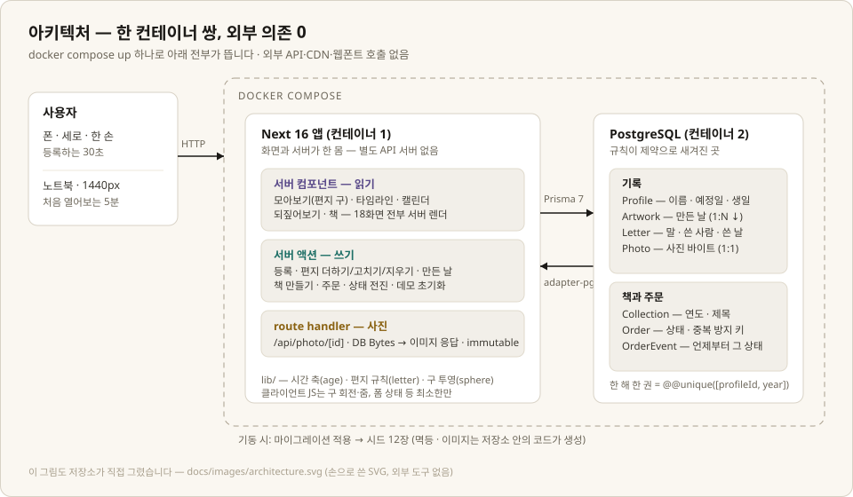

# 한 장, 한 마디

아이가 남긴 것을 그때의 말과 함께 받아두고, 한 해가 지나면 한 권으로 묶습니다.
그래서 실물을 마음 편히 정리할 수 있게 합니다.

이 문서는 과제 안내의 README 구성(소개 → 실행 → 레벨 → UX → 스택 → AI → 설계 의도)을
그대로 따릅니다. 바쁘시면 [실행 방법](#실행-방법)과 [화면 미리보기](#화면-미리보기)만 보고
켜셔도 됩니다 — 실행에 필요한 것은 그 절 하나에 다 있습니다.

*저장소 이름 `one-year-one-book`은 첫 이름 "한 해, 한 권"의 흔적입니다.
이름이 책에서 남기는 순간(사진 한 장, 말 한 마디)으로 옮겨온 경위는
[docs/decisions/16-letters.md](./docs/decisions/16-letters.md)에 있습니다.*

---

## 서비스 소개

**어떤 서비스인가** — 육아 실물 기록 서비스입니다. 산부인과에서 받은 초음파 사진부터
그림·만들기·상장까지, 손에 들려 있는 것을 사진 한 장과 그때의 말로 받아둡니다.
한 해가 지나면 그 해의 기록이 책 한 권으로 묶입니다. 책은 부가 기능이고,
서비스가 잘해야 하는 일은 콘텐츠(사진과 말)를 제대로 받아두는 것입니다.

**누구를 위한 것인가**

| | |
|---|---|
| 누구 | 33세 부모. 첫 아이의 임신에서 초등 저학년까지, 같은 사람의 8~9년 |
| 언제 | 손에 실물이 들려 있고 어디 둬야 할지 모르는 순간. 쓸 수 있는 시간은 30초 남짓 |
| 무엇으로 | 스마트폰, 세로, 한 손 |

두 번째 사용자는 이 저장소를 처음 여는 심사자입니다 — clone에서 브라우저까지 5분,
노트북 1440px. 두 사람을 동시에 만족시키는 방법이 반응형이라, 반응형이 취향이 아니라
요구사항이었습니다.

**주요 기능**

| 기능 | 설명 |
|---|---|
| 남기기 | 사진 한 장 + 만든 날 + 말. 등록은 언제나 열려 있고, 30초 안에 끝나도록 필수 항목을 최소로 |
| 편지 | 한 기록에 여러 통이 쌓입니다 — 그때 받은 말, 3년 뒤 다시 물어본 말, 태담. 만든 날과 쓴 날이 다르면 화면이 그 간격을 말합니다("7년 3개월 뒤에 쓴 편지") |
| 모아보기 (홈) | 폰은 사진 격자, 노트북은 봉투들이 지구본처럼 도는 편지 구(sphere). 연도·달로 좁히고 남긴 말로 검색 |
| 타임라인 | 임신 주차에서 만 나이까지 8~9년이 한 줄. 부르는 단위가 바뀌는 자리에 표가 섭니다 |
| 캘린더 | 그달 남긴 것과 영유아 건강검진 창을 한 장에. 검진 구간은 국민건강보험공단 공표 기준 |
| 되짚어보기 | 사진 없이 말만 세로로 쌓아 보여줍니다 — 버리고 나면 남는 것이 그것이라서 |
| 책·주문 | 한 해 = 한 권. 버튼 하나로 묶고, 접수 → 인쇄 → 배송 상태를 기록·관리 |

**왜 이 서비스인가** — 모아서 책으로 만들어 주는 서비스는 이미 있습니다. 이건 방향이
반대입니다. 보통의 기록은 남기려고 하지만, 이 서비스는 버리려고 기록합니다. 아이 그림은
"버리면 이 시절이 없어지는 것 같아서" 쌓이는데, 그 종이 더미는 아무도 다시 보지 않습니다.
그리고 사진만 보면 절대 알 수 없는 것이 말입니다 — 머리만 그린 자화상의 사연이
"그리다가 밥 먹으래서 못 그린 거야"라는 것은 그때 안 물어보면 영영 사라집니다.
그래서 저장 후 문구도 "저장되었습니다"가 아니라 **"남았습니다. 이제 원본은 정리하셔도
됩니다."** 입니다.

---

## 실행 방법

필요한 것은 Docker 하나입니다. `.env` 준비도, 로그인도, 외부 API 키도 없습니다.

```bash
git clone https://github.com/wechang123/one-year-one-book.git
cd one-year-one-book
docker compose up --build
```

구버전 Docker라면 `docker-compose up --build`로 실행됩니다(같은 파일로 동작합니다).

<http://localhost:3000> 을 열면 홈(모아보기)이 뜹니다. 임신 14주부터 초등 저학년까지
시드 12장이 이미 들어 있고, 기동할 때 마이그레이션과 시드가 자동으로 실행됩니다
(시드는 멱등이라 다시 켜도 늘지 않습니다).

**포트가 이미 쓰이고 있다면** — 호스트 포트를 환경변수로 바꿉니다.

```bash
PORT=8080 DB_PORT=5555 docker compose up --build
```

| 변수 | 기본값 | 역할 |
|---|---|---|
| `PORT` | 3000 | 앱을 띄울 호스트 포트 |
| `DB_PORT` | 5433 | PostgreSQL 호스트 포트 |

**마음껏 눌러보셔도 됩니다** — 홈 맨 아래(넓은 화면에서는 왼쪽 아래 귀퉁이)의
[처음 상태로 되돌리기]가 직접 등록·수정한 것을 지우고 시드 원문까지 복원합니다.

---

## 화면 미리보기

실행하면 이 상태 그대로 뜹니다. 캡처와 본문의 실측값은 macOS 기준입니다.

| 홈 — 편지 구 (노트북) | 봉투에 커서를 대면 |
|---|---|
|  |  |

| 한 장 상세 — 도착한 편지들 | 좁은 화면 — 격자와 하단 탭 |
|---|---|
|  |  |

화면은 사이드바(폰은 하단 탭)의 다섯 칸으로 오갑니다.

| 화면 | 경로 | 역할 |
|---|---|---|
| 모아보기 | `/` | 폰: 격자 훑기 · 노트북: 편지 구. 연도·달 좁히기, 남긴 말로 검색 |
| 타임라인 | `/timeline` | 8~9년을 한 줄로. 단위가 언제 갈아탔는지 |
| 캘린더 | `/calendar` | 그달의 기록과 지금 열려 있는 검진 창 |
| 되짚어보기 | `/recall` | 버리고 나면 무엇이 남는지 |
| 책 | `/books` | 어느 해가 몇 장인지, 어느 해를 묶었는지 |

등록(`/artwork/new`) · 상세(`/artwork/[id]`, 편지 읽기·더하기) · 만든 날 고치기 ·
편지 고치기/지우기(`/letter/[id]/edit`) · 아이 정보(`/child`) · 책 상세와 주문
(`/book/[year]`, `/orders`)이 그 아래에 있습니다. 404와 실패 화면에도 같은 뼈대가
있어 막힌 자리에서 나갈 길이 늘 있습니다.

---

## 완성한 레벨

Lv1 · Lv2 · Lv3 모두 구현했습니다.

**Lv1 — 핵심 플로우.** 등록 → 조회(모아보기·타임라인·캘린더·되짚어보기) → 편집이
동작합니다. 사진은 DB `Bytes` 컬럼에 저장하고 route handler로 서빙합니다
(`public/`에 쓰면 재시작 전까지 404가 나기 때문). 작품과 사진은 한 트랜잭션으로
만들어 "사진 없는 작품"이 생길 수 없고, 파일 형식은 브라우저가 주장하는 `File.type`이
아니라 바이트 앞부분에서 판정합니다. 말은 편지(Letter) 테이블로 1:N — 같은 기록에
시점이 다른 여러 통이 쌓이고, 편지 단위로 고치고 지웁니다(지우기는 두 단계 확인).
날짜는 그 시기의 말로 불립니다(임신 24주 3일 · 생후 6개월 · 만 7세 2개월). 발달
판정은 하지 않습니다.

**Lv2 — 주문.** 책 만들기(버튼 1) → 주문 넣기(받는 사람·연락처·주소) → 목록·상세 →
상태 전진(접수 → 인쇄 → 배송)이 동작합니다. 수록작은 저장하지 않고 만든 날의 연도로
매번 계산합니다 — 외래키를 두면 "2026년에 만든 것이 2025년 책에 담기는" 모순이 가능해
집니다. 상태 갱신과 이력 추가는 한 트랜잭션이고, 중복 주문은 화면(버튼 잠금)과
서버(유니크 키) 두 겹으로 막습니다. 주문번호는 전화로 부를 수 있는 형태입니다
(`20260803-7K2M`, 헷갈리는 글자 제외).

**Lv3 — UX.** 첫 화면 머리말이 서비스를 설명하고, 화면마다 진한 버튼은 하나입니다.
주문 상태는 사용자 말로 표시합니다(접수됨/인쇄 중/배송 중). 빈 목록·입력 실수·로딩·
실패 각각에 화면이 있고, 오류가 나면 배너가 보이는 곳으로 스크롤한 뒤 문제가 된 칸에
초점이 갑니다. 900px을 경계로 사이드바와 하단 탭이 교대합니다.

**만들지 않은 것과 이유** — 가격·쪽수·배송예정일(제작 사양이 없는데 지어내면 근거가
없음), 배송완료 상태(배송사 연동 없이 누가 언제 바꾸는지 설명 불가), 결제·로그인
(과제 범위 밖, 없다는 사실을 주문 화면이 밝힘), 사진 교체(교체 불가가 사진 캐시
`immutable`과 시드 복원을 성립시키는 전제). 시간이 없어서가 아니라 근거가 없어서
안 만든 것들입니다.

---

## 사용자 경험(UI/UX) 설계

타겟 세 줄(33세 부모 · 실물이 들려 있는 30초 · 폰 세로 한 손)이 화면 결정 대부분을
정했습니다.

| 결정 | 근거 |
|---|---|
| 말이 필수가 아님 | 30초 안에 못 물어보는 날이 있습니다. 필수로 막으면 말을 못 받은 날엔 사진도 못 남깁니다 |
| 종류(그림·상장·초음파)를 묻지 않음 | 물으면 등록이 무거워지는데 화면이 그 값으로 하는 일이 없습니다. 배치는 사진 비율이 풀고, 시기는 날짜가 정합니다 |
| 등록에 주기·마감 규칙 없음 | 트리거가 앱 밖에 있습니다 — 아이가 그림을 들고 오는 순간. 앱이 만들지 않아도 반드시 일어납니다 |
| 만든 날을 EXIF에서 안 뽑음 | 사진 찍은 날과 아이가 만든 날은 다릅니다. 벽에 붙어 있던 그림을 오늘 찍는 일이 흔합니다 |
| 버튼 44px · 입력 글씨 16px | 한 손 엄지의 최소 표적 · iOS는 16px 미만 입력칸에서 화면을 확대합니다 |
| 태어나기 전 날짜는 말의 주인을 부모로 확정 | 태아는 말을 하지 않습니다. 화면이 무엇을 보냈든 서버가 판정합니다 |
| 시기 색(보라·청록·황토) | 색이 장식이 아니라 시간 축입니다. 색만으로 구분되는 정보는 없습니다(항상 글자 동반) |

**반응형** — 원칙은 "화면이 넓어지면 칸이 커지는 게 아니라 더 많이 보인다"입니다.
900px 경계에서 사이드바/하단 탭, 그리고 모아보기의 편지 구/격자가 교대합니다.
실측: 375px 격자 1열 327px, 899px 3열 272px, 900px 이상은 편지 구(회전 무제한+관성,
페이지 스크롤 없음 — 스크롤이 "내리기"와 "당겨보기" 두 일을 하면 어느 쪽도 믿을 수
없어서 화면을 잠갔습니다).

**의도적으로 넣지 않은 것** — 발달 기준("이 나이면 보통 이 정도")은 어떤 형태로도
넣지 않았습니다. 앱이 한 줄만 띄워도 부모는 믿고, 틀렸을 때 대가는 아이가 치릅니다.
지나간 검진 창을 "놓쳤다"고 말하지 않는 것, 산전진찰 날짜를 만들어내지 않는 것(출처가
준 것은 간격), 예방접종 일정을 아예 뺀 것(공식 표를 직접 확인 못 함 + 해마다 바뀜)도
같은 축입니다.

**참조한 것** — 편지 구와 봉투는 [typo.love](https://www.typo.love)를 보고
만들었습니다. 봉투 은유·미리보기·종이 질감을 가져오되, 봉투에 드는 것을 사진이 아니라
말로 바꿨고(사진은 보라고 있는 것), WebGL 대신 회전 행렬 두 개짜리 수학으로, 배경
음악 대신 정적을 뒀습니다. 디자인 지침 모음
[taste-skill](https://github.com/Leonxlnx/taste-skill)은 명령이 아니라 검사 항목으로
읽어 실측 후 고쳤습니다. 전말은 [docs/decisions/](./docs/decisions/)에 있습니다.

---

## 기술 스택 및 아키텍처

Next 16 (App Router) · React 19 · TypeScript · Prisma 7 + `@prisma/adapter-pg` ·
PostgreSQL 18 · UI 라이브러리 없음(CSS 직접 작성) · 외부 API/LLM 호출 없음.

**왜 이 조합인가** — 이 앱의 화면은 전부 "DB를 읽어 그린 목록·상세·폼"이라, 한
프레임워크가 화면과 서버를 같이 들면 경계 비용이 없어집니다. 서버 컴포넌트가 조회를,
서버 액션이 등록·편집·주문을 맡아 별도 API 서버 없이 성립합니다. PostgreSQL인 이유는
핵심 규칙 두 개를 DB 제약으로 지키기 때문입니다 — "한 해에 한 권"은
`@@unique([profileId, year])`가, 중복 주문은 유니크 해시 키가 막습니다. Prisma는 그
제약의 변천을 마이그레이션 이력으로 남깁니다. Tailwind는 쓰지 않았습니다 — 같은 클래스
조합이 흩어지지 않고 이름 하나(`.blank`를 일곱 화면이 공유)로 모이는 규모라, 이름을
붙인 쪽이 짧았습니다.



```
app/            화면(서버 컴포넌트)과 서버 액션. 경로가 곧 화면
  api/photo/    사진 서빙 route handler (DB Bytes → 이미지 응답)
lib/            시간 축(age) · 편지 규칙(letter) · 구 투영(sphere) · 검증 로직
prisma/         스키마와 마이그레이션 — 데이터 구조가 왜 이렇게 됐는가의 기록
scripts/        시드 이미지 생성기 (고정 시드라 몇 번을 돌려도 같은 바이트)
docs/           판단 기록 — 화면별 결정, 작업 일지, 타당성 조사
```

기술적으로 걸렸던 함정 두 가지는 코드에 근거와 함께 적어 뒀습니다. 업로드 파일을
`public/`에 쓰면 재시작 전까지 404라는 것(그래서 DB 저장), 그리고 Server Action
`bodySizeLimit`(기본 1MB)이 파일이 아니라 요청 본문 전체에 걸린다는 것 — 앱의 사진
한도(8MiB)와 같게 두면 한도 초과 파일에서 준비해 둔 한국어 안내가 영영 실행되지 않는
죽은 코드가 됩니다. 8.5MB 파일로 재현해 확인하고 12MB로 뒀습니다.

시드 이미지 12장은 저장소 안의 코드(`scripts/seed-images.mjs`)가 그립니다. 실물 사진
대신 코드 생성을 택한 이유는 초음파·상장을 CC0로 구할 수 없어서(실존 인물의 기록)이고,
이미지 모델 대신 코드인 이유는 재현성입니다 — 같은 프롬프트로 같은 그림이 다시 나오지
않으면 저장소가 자기 시드를 재현할 수 없습니다. 실존 인물·기관명·아이 얼굴은 없습니다.

---

## AI 도구 사용 내역

이 저장소는 AI 에이전트(Claude Code)와 페어로 만들었습니다. 에이전트에게 준 작업
규칙이 [CLAUDE.md](./CLAUDE.md)이고, 첫 규칙이 "이해하지 못한 코드는 채택하지
않는다"입니다. 커밋이 논리 단위로 쪼개져 있고 본문에 근거가 적혀 있는 것이 그
규칙의 흔적입니다.

| 도구 | 활용 |
|---|---|
| Claude Code | 설계·구현·검증 페어 프로그래밍, 화면별 판단 기록 작성 |
| Claude Code | 시드 콘텐츠 — 문장 10개(그림을 열어 보고 작성), 이미지 12장(코드 생성) |
| Claude Code | 타당성 조사 — 출처를 확인할 수 없는 수치는 버림 |

쓰면서 틀린 것과 잡은 방법이 이 항목의 핵심이라고 봅니다. 대표 사례 여섯:

| 무엇이 틀렸나 | 어떻게 잡았나 |
|---|---|
| 크기 검사가 도달할 수 없는 코드였다 | 8.5MB 파일을 실제로 만들어 재현 — `bodySizeLimit`은 파일이 아니라 본문 전체에 걸린다 |
| [다시 시도]가 복구를 못 했다 | DB를 껐다 켜고 눌러봄 — 표준 `reset()`이 아니라 `router.refresh()`가 필요했다 |
| 창 크기 도구가 375를 "성공"이라 반환하고 500을 줬다 | 도구의 성공 반환값은 결과가 아니라 주장 — 이후 실측은 iframe 안에서 |
| 검사 스크립트가 파일 하나를 조용히 건너뛰었다 | 결과가 0일 때는 검사가 동작했다는 증거를 따로 확보 |
| euc-kr 코덱을 KS X 1001로 오인 | 2,350자가 아니라 11,172자가 통과하는 걸 보고 바이트 구역을 직접 스캔 |
| 문서가 자기 화면을 잘못 가리켰다(4곳) | 화면을 세 번 갈아엎는 동안 서술이 낡음 — 처음부터 끝까지 직접 걸어 발견 |

전체 목록(35건)과 각각의 전말은 [docs/ai-notes.md](./docs/ai-notes.md)와
[docs/worklog.md](./docs/worklog.md)에 시각과 함께 있습니다.

---

## 설계 의도

**왜 이 아이디어인가** — 위 [서비스 소개](#서비스-소개)의 "버리려고 기록한다"가
출발점입니다. 인쇄 API를 활용할 법한 콘텐츠 서비스 중, 콘텐츠(아이의 실물과 말)가
본체이고 책이 그 위의 부가 기능인 구조를 가장 자연스럽게 성립시키는 주제라고
판단했습니다.

**사업적 가능성** — 조사 근거는 [docs/03-feasibility.md](./docs/03-feasibility.md)에
있습니다. 아카이브만 하는 서비스는 죽고 인쇄를 붙인 곳만 살아남았습니다(Artkive·
Plum Print·Artsonia는 현역, 저장만 하는 Keepy는 도메인 인증서까지 만료). 객단가는
Artkive 기준 $75~$740. 경쟁 조사가 설계를 바꾼 지점도 있습니다 — 아이 목소리 기록은
이미 선점돼 있어 차별점을 "기록 → 확인 → 폐기 승인 → 한 권"의 완결 동선으로
옮겼고, 기관 채널을 가진 사업자와의 정면승부 대신 인쇄사의 연 1회 리텐션 장치로
자리를 잡았습니다. 물량이 연말에 집중되는 패턴은 인쇄사에 유리하지만 비수기 가동률
개선 효과는 없다는 것, 한국 시장 규모 통계는 찾지 못했다는 것도 그대로 적습니다.

**더 시간이 있었다면** — 말을 더 잘 받는 장치(지금은 부모가 옮겨 적으며 말이
짧아집니다), 책 미리보기와 쪽 구성, 여러 아이(스키마는 준비돼 있고 화면이 한 명
전제), 사진 리사이즈(성능을 실측할 근거가 생기면), 스크린리더 전 화면 통과.

---

## 알고 있는 한계

고칠 수 있는데 안 한 것이 아니라, 알고 있고 지금 고치지 않기로 한 것들입니다.

1. 실패 화면은 JS가 켜져 있어야 뜹니다 — 에러 바운더리가 클라이언트 컴포넌트라서.
   입력 실수는 JS 없이도 서버가 한국어로 거절합니다.
2. 중복 주문 차단에 이론적으로 좁은 틈이 있습니다(시간 버킷 경계의 동시 요청).
   완전히 없애려면 클라이언트 발급 Idempotency-Key가 필요합니다.
3. 주문 목록은 최근 50건까지 보이고, 잘렸다는 사실을 화면이 말합니다.
4. `origin` 기본값이 모델마다 다릅니다. 지금은 안 터지지만 시드에 책·주문을 넣게
   되면 손봐야 하고, 스키마에 그 조건을 적어 뒀습니다.
5. 접근성은 초점 이동·`role="alert"`·44px까지 했지만 스크린리더 전 화면 통과는
   못 했습니다.
6. 모델 이름이 `Artwork`인데 담기는 것은 작품만이 아닙니다. 화면에서는 "작품"을
   걷어냈고, 테이블 이름 변경은 화면에 주는 것이 없어 미뤘습니다.
7. 시드 이미지는 자세히 보면 생성물임이 보입니다. 속이려는 것이 아니라 소품이고,
   대가로 재현성을 얻었습니다.
8. 캘린더에 예방접종 일정이 없습니다 — 공식 표를 직접 확인하지 못했고 해마다
   바뀝니다. 화면의 "이 달력이 담지 않은 것"이 직접 밝힙니다.
9. 검진을 실제로 받았는지는 앱이 모르고, 그래서 "놓쳤다"고 말하지 않습니다.

---

## 더 읽을 것

판단의 전말은 저장소 안에 있습니다. 커밋이 논리 단위로 쪼개져 있고(이슈 → 브랜치 →
PR → squash), 갈림길에서 무엇을 버렸는지는 문서가 말합니다.

| 문서 | 내용 |
|---|---|
| [docs/decisions/](./docs/decisions/) | 화면별 판단 기록 — 갈림길, 넣지 않은 것, 뒤집힌 판단(취소선) |
| [docs/worklog.md](./docs/worklog.md) | 무엇이 틀렸고 어떻게 발견했는지, 시각과 함께 |
| [docs/ai-notes.md](./docs/ai-notes.md) | AI 사용 기록 전체 — 틀린 것 35건 |
| [docs/01-problem.md](./docs/01-problem.md) · [02-user.md](./docs/02-user.md) · [03-feasibility.md](./docs/03-feasibility.md) | 문제 · 사용자 · 타당성 |
| [docs/04-content.md](./docs/04-content.md) · [04b-생성이미지.md](./docs/04b-%EC%83%9D%EC%84%B1%EC%9D%B4%EB%AF%B8%EC%A7%80.md) | 시드 문장과 이미지의 근거 |
| [CLAUDE.md](./CLAUDE.md) | AI 에이전트에게 준 작업 규칙 |

초기 화면 4개의 PR은 공개 저장소에 없습니다. 공개 전 히스토리 정리 때 저장소를
다시 만들면서 이슈·PR이 함께 사라졌고, 그때 PR 본문의 판단을 docs/decisions/로
저장소 안에 옮겼습니다. 그 사고 자체도 기록으로 남겼습니다.
