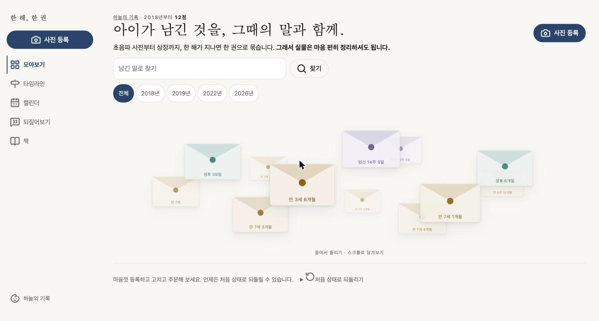
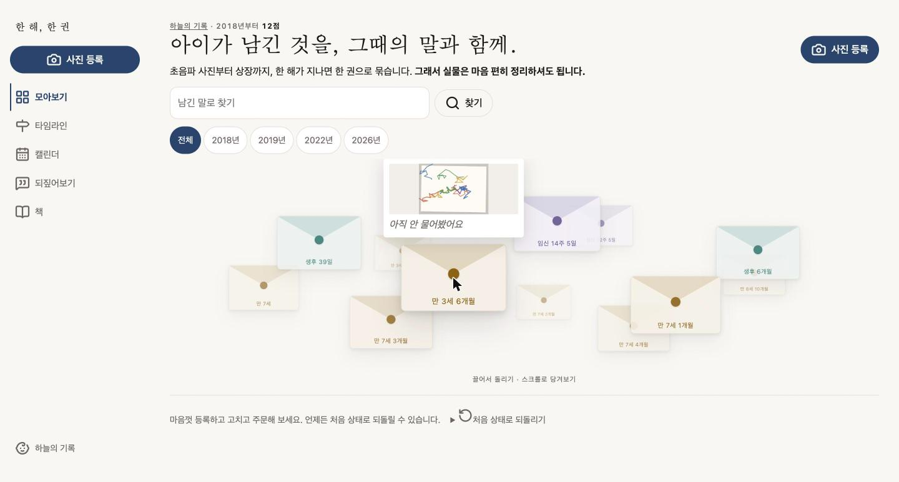
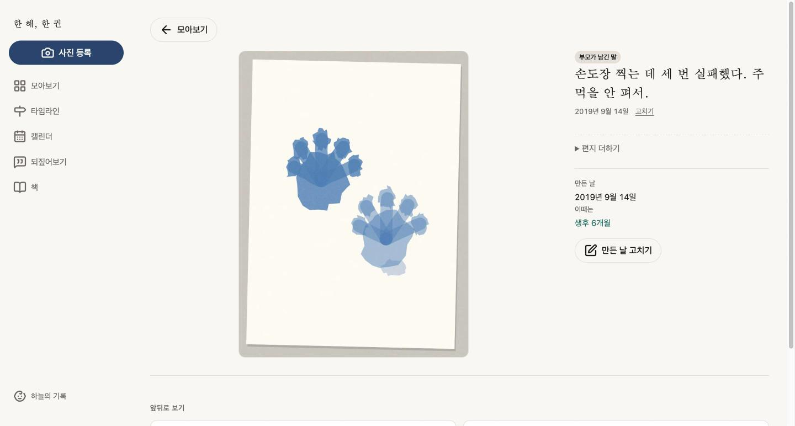
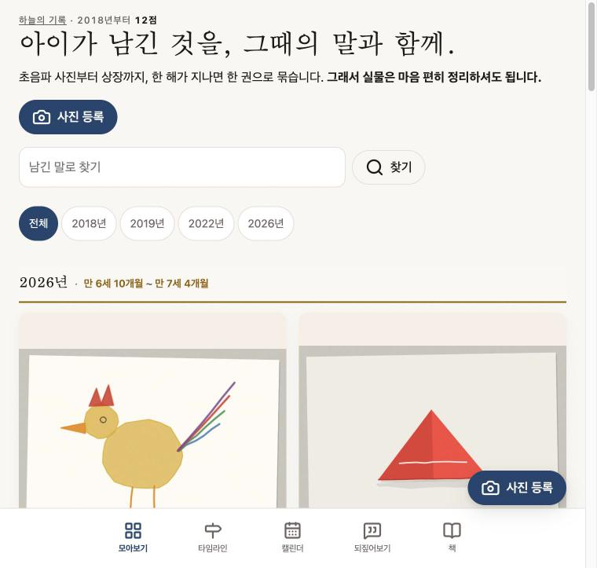

# 한 장, 한 마디

> **아이가 남긴 것을 그때의 말과 함께 받아두고, 한 해가 지나면 한 권으로 묶는다.
> 그래서 실물을 마음 편히 정리할 수 있게 한다.**

*(저장소 이름 `one-year-one-book`은 첫 이름 "한 해, 한 권"의 흔적입니다. 이름이 책에서
**남기는 순간**(사진 한 장, 말 한 마디)으로 옮겨온 이유는
[16-letters §0-b](./docs/decisions/16-letters.md)에 있습니다 — 주소는 약속이라 바꾸지 않았습니다.)*

⏱ **시간이 없으시다면 — 10분 경로.** 이 문서는 판단 기록까지 담아 길다. 심사에 필요한 뼈대는 다섯 곳이다.

1. [실행 방법](#실행-방법) — 복붙 세 줄, Docker만 필요. 켜면 시드 12장이 들어 있다
2. [화면 미리보기](#화면-미리보기) 넉 장 → 켠 화면에서 봉투를 직접 돌려보기
3. [완성한 레벨](#완성한-레벨) — Lv1·Lv2·Lv3 무엇을 했는지
4. [사용자 경험 설계](#사용자-경험uiux-설계) — 누구를 위해, 왜 이렇게 배치했는지
5. [AI가 틀렸고 내가 잡은 것](#-ai가-틀렸고-내가-잡은-것) — 이 저장소가 가장 팔고 싶은 표

나머지는 그 판단들의 전말이다 — 더 깊은 것은 [`docs/decisions/`](./docs/decisions)에 화면별로 있다.

---

## 서비스 소개

### 누가 씁니다

| | |
|---|---|
| **누구** | **33세 부모.** 첫 아이를 가졌을 때 이 서비스를 만났고, 지금 그 아이가 초등학교에 들어갔습니다 |
| **언제** | **손에 실물이 들려 있고 어디 둬야 할지 모르는 순간.** 산부인과 복도에서 초음파 사진을 받아 나올 때, 아이가 그림을 내밀 때. 다른 손엔 가방이 들려 있고 **쓸 수 있는 시간은 30초 남짓** |
| **무엇으로** | **스마트폰, 세로, 한 손** |

🔴 **임산부와 초등 부모는 다른 사람이 아닙니다. 같은 사람의 8~9년입니다.**
그래서 화면은 하나이고, **중심에 두는 시기는 유아**입니다 — 밀도가 가장 높고(주 1~2회)
실물이 가장 빨리 쌓입니다. **임신·영아 구간은 입구입니다** —
첫 아이를 가진 사람이 이 서비스를 처음 만나는 지점이고, 거기서 시작하면
그림이 쏟아지는 시기에 이미 여기 와 있습니다.

두 번째 사용자가 있습니다 — **이 저장소를 처음 여는 사람.**
`clone` → `up` → 브라우저까지 **5분**, **노트북 가로 1440px**.
두 사람을 동시에 만족시키는 방법이 반응형이고, 그래서 반응형이 취향이 아니라 요구사항입니다.

### 무엇을 합니다

| | |
|---|---|
| **남긴다** | 사진 한 장 + 만든 날 + **편지**. 그림, 만들기, 상장, 초음파 사진 — 손에 들려 있는 것이면 됩니다. 등록은 언제나 열려 있습니다 |
| **편지가 쌓인다** | 한 기록에 **여러 통**이 도착합니다 — 그때 받은 말, 3년 뒤에 다시 물어본 말, 태담. 만든 날과 쓴 날이 다르면 화면이 그 간격을 말합니다: *"7년 3개월 뒤에 쓴 편지"* |
| **부른다** | 날짜를 그 시기의 말로 부릅니다 — `임신 24주 3일` · `생후 6개월` · `만 7세 2개월`. **판정은 하지 않습니다** |
| **한 줄로 본다** | `타임라인` — 임신 주차에서 만 나이까지 **8~9년이 한 줄**입니다. 부르는 단위가 갈아타는 자리에만 표가 섭니다 |
| **날짜로 본다** | `캘린더` — 그달 남긴 것과 **영유아 건강검진 창**을 한 장에. 검진 구간은 국민건강보험공단이 정한 것을 옮겼습니다 |
| **모아서 본다** | `모아보기` — 폰은 사진 격자, 노트북(900px↑)은 **봉투들이 지구본처럼 도는 편지 구(sphere)**. 연도·달 침으로 좁히고, 남긴 말로 찾으면 걸린 봉투만 남아 다시 고르게 퍼집니다 |
| **되짚는다** | `되짚어보기` — 사진을 한 장도 안 보여주고 **말만** 세로로 쌓아 보여줍니다. 버리고 나면 남는 것이 그것이기 때문입니다 |
| **묶는다** | 한 해 = 한 권. 수록작은 저장하지 않고 **만든 날의 연도로 계산**합니다 |
| **주문한다** | 받는 사람·연락처·주소. `접수 → 인쇄 → 배송` 상태를 기록하고 흐름을 관리합니다 |
| **되돌린다** | [처음 상태로 되돌리기] — **망가뜨릴 수 없으면 아무도 안 눌러봅니다** |

> 🔑 **앞의 넷은 같은 기록을 네 가지 방식으로 보는 것입니다.** 넷 중 어느 것도 나머지에
> 딸려 있지 않아서 나란히 놓는 자리가 필요했고, 그게 사이드바입니다.
> [왜 v2에서 뼈대를 다시 세웠는지](#v2-뼈대를-다시-세웠습니다)

### 🔑 왜 이 서비스가 다른가

**"모아서 책으로 만들어주는" 서비스는 이미 있습니다. 이건 방향이 반대입니다.**

보통의 기록은 **남기려고** 합니다. 이건 **버리려고** 기록합니다.

아이 그림은 버릴 수 없어서 쌓입니다. 아까워서가 아니라
*"이걸 버리면 이 시절이 없어지는 것 같아서"*입니다. 그런데 그 종이 더미는 **아무도 다시 보지 않습니다.**
보관과 기억은 다른 일입니다.

그래서 두 가지가 따라옵니다.

- **이 서비스가 다루는 것은 콘텐츠입니다 — 아이가 만든 것과 아이가 한 말.**
  책은 그 콘텐츠를 활용하는 쪽이고, **사용자의 목적**입니다.
  둘은 다릅니다. 화면 속 데이터로는 실물을 버릴 결심이 서지 않으니
  **손에 잡히는 것이 손에 잡히는 것을 대신해야 하고**, 그게 책이 필요한 이유입니다.
  다만 **서비스가 잘해야 하는 일은 콘텐츠를 제대로 받아두는 것**입니다 —
  받아둔 것이 없으면 묶을 것도 없습니다.
- **그중에서도 말이 핵심입니다.** 사진만 보면 **절대 알 수 없는 것**이
  시드에서 **말이 있는 모든 점**이 그렇습니다 — 톱니 같은 이빨이 *"다 웃는 거야"*이고,
  머리만 있는 자화상이 *"그리다가 밥 먹으래서 못 그린 거야"*이고,
  초음파 사진 한 장이 *"오늘 처음 심장 소리 들었어"*입니다.
  **안 물어보면 이 논리는 사라지고, 어른은 "아직 못 그린다"로 읽습니다.**
  그래서 홈은 기록(편지 구·격자)이 전부이고, 책은 사이드바 다섯 칸의 **마지막 한 칸**입니다.
  그리고 **두 점은 말이 비어 있습니다** — *"아직 안 물어봤어요."*
  30초 안에 못 물어보는 날이 있고, **필수로 막으면 말을 못 받은 날엔 사진도 못 남깁니다.**
  그 판단을 화면이 실제로 보여주도록 시드에 그 상태를 넣었습니다.
- **말의 주인이 시기마다 다릅니다.** 태아는 말을 하지 않습니다.
  전에는 *"어른의 말은 안 받는다"*였는데, 그건 **아이가 말을 할 수 있을 때의 판단**이었습니다.
  금지를 푸는 대신 **누가 한 말인지를 같이 저장합니다** — 부모의 말은 부모의 말로 남으므로
  원래 막으려던 것(어른의 해석이 아이 말로 둔갑하는 것)은 **그대로 막힙니다.**

그래서 저장 후 문구가 *"저장되었습니다"*가 아니라
**`남았습니다. 이제 원본은 정리하셔도 됩니다.`**입니다.

---

## 화면 미리보기

*(실행하면 이 상태 그대로 뜹니다 — 시드 12장이 이미 들어 있습니다. 실측·캡처는 macOS 기준.)*

| 홈 — 편지 구 (노트북) | 봉투에 커서를 대면 |
|---|---|
|  |  |

| 한 점 상세 — 도착한 편지들 | 좁은 화면 — 격자와 하단 탭 |
|---|---|
|  |  |

---

## 실행 방법

**필요한 것은 Docker 하나. `.env`도, 로그인도, 외부 API 키도 필요 없다.**

```bash
git clone https://github.com/wechang123/one-year-one-book.git
cd one-year-one-book
docker compose up --build
```

(구버전 Docker라면 `docker-compose up --build` — 같은 파일로 동작한다.)

→ <http://localhost:3000> 을 열면 **모아보기**가 뜬다 — 노트북에서는 봉투들이 지구본처럼 도는
**편지 구(sphere)**, 폰에서는 사진 격자다. 임신 14주부터 초등 저학년까지 **12장이 이미 들어 있다.**
왼쪽 사이드바(폰이면 하단 탭)에 **모아보기 · 타임라인 · 캘린더 · 되짚어보기 · 책** 다섯 칸이 있다.

기동할 때 마이그레이션이 적용되고 시드가 실행된다. 시드는 멱등이라 다시 켜도 늘지 않는다.

> 여기 **개수를 적어뒀다가 틀렸다.** 마이그레이션은 늘어나는데 문장은 안 늘어난다.
> 부팅 로그가 실제 개수를 찍으므로 **문서가 그 숫자를 두 번 말할 이유가 없다.**

### 포트가 이미 쓰이고 있다면

호스트 포트는 환경변수로 바꾼다. 컨테이너 안은 항상 3000이다.

```bash
PORT=8080 DB_PORT=5555 docker compose up --build
```

| 변수 | 기본값 | 하는 일 |
|---|---|---|
| `PORT` | `3000` | 앱을 띄울 호스트 포트 |
| `DB_PORT` | `5433` | Postgres 호스트 포트 (5432 대신 5433인 이유는 아래) |

> 🔑 **이 변수는 장식이 아니라 실제로 필요해서 생겼다.**
> 개발 중 `docker compose up`이 *"Bind for 0.0.0.0:5433 failed"*로 죽었다.
> 같은 머신에서 돌던 다른 프로젝트의 DB가 그 포트를 잡고 있었다.
> **남이 쓰는 포트를 뺏는 대신 이쪽이 비켜갈 수 있어야 한다**고 보고 포트를 환경변수로 뺐다.
> 그 이후로도 5433은 계속 막혀 있었고, 그래서 이 값은 문서가 아니라 사고로 검증됐다.

---

## 완성한 레벨

**Lv1 · Lv2 · Lv3 모두 구현했습니다.**

### Lv1 — 핵심 플로우 (작품 등록 · 조회 · 편집)

| 화면 | 무엇을 하나 |
|---|---|
| 홈 `/` | **모아보기** — 폰은 격자, 노트북은 편지 구. **남긴 말로 찾기** · 연도·달 침 |
| 타임라인 `/timeline` | 자란 순서. 사진 · 도착한 편지들 · **그 시기의 이름**(`만 7세 2개월`) |
| 상세 `/artwork/[id]` | 사진을 **원본 비율 그대로** 크게. **편지 전부**(누가·언제·간격) + **편지 더하기**. 아래에 **앞뒤 한 점씩 나란히** |
| 등록 `/artwork/new` | 사진 + **누구의 말인지** + 그때의 말 + 만든 날. 고르기 전에 **자리가 스스로 설명**하고, 고르면 같은 자리에 미리보기 |
| 편집 | 작품은 **만든 날**(`/artwork/[id]/edit`) · 편지는 **통별로**(`/letter/[id]/edit`, 지우기는 두 단계 확인) |
| 아이 정보 `/child` | 이름 · **출산예정일 · 태어난 날.** 시간 축이 여기서 나온다 |
| 되짚어보기 `/recall` | **사진이 한 장도 없다.** 버리고 나면 남는 것만 |

- 날짜가 **그 시기의 말로 불립니다** — `임신 24주 3일` · `생후 6개월` · `만 7세 2개월`. **판정은 하지 않습니다**([왜](#이-나이면-보통-어느-정도인가요)).
- **태어나기 전 날짜에는 서버가 말의 주인을 부모로 확정합니다.** 화면에서 무엇을 보냈든 태아는 말을 하지 않습니다.
- 사진은 **DB `Bytes` 컬럼**에 넣고 route handler로 서빙합니다(`public/`에 쓰면 재시작 전까지 404).
- 작품과 사진을 **한 트랜잭션**으로 만들어 *"사진 없는 작품"*이 생길 수 없게 했습니다.
- 형식은 `File.type`이 아니라 **바이트 앞부분(매직 넘버)**에서 읽습니다.
- **JS 없이도 서버가 입력 실수를 거절합니다** — 사진 없음 · 형식 위조 · 미래 날짜.

### Lv2 — 주문 저장 · 조회 · 상태 관리

| 화면 | 무엇을 하나 |
|---|---|
| 책 만들기 (홈의 `한 해가 한 권`) | **버튼 하나**로 그 해의 책을 만듭니다 |
| 책 상세 `/book/[year]` | 그 해 작품을 **1월부터** 격자로. 표지 제목 수정 |
| 주문 넣기 `/book/[year]/order` | 받는 사람 · 연락처 · 주소 |
| 주문 목록 `/orders` | 조인 없이 현재 상태만 읽습니다 |
| 주문 상세 `/orders/[orderNo]` | **언제부터 그 상태였나** — 이력을 시간순으로 |
| 상태 전진 | `접수 → 인쇄 → 배송` |

- 수록작을 저장하지 않고 **`madeOn`의 연도로 매번 계산**합니다 — 외래키를 두면 *"2026년에 만들었는데 2025년 책에 담긴 작품"*이 만들어질 수 있습니다.
- **주문번호는 사람이 전화로 부를 수 있는 형태**입니다(`20260803-7K2M`). 헷갈리는 글자(`0 O 1 I L`)를 뺐습니다.
- 상태 갱신과 이력 추가는 **한 트랜잭션**입니다. 따로 쓰면 목록과 상세가 서로 다른 말을 합니다.
- 중복 클릭 대응이 **둘로 나뉘어** 있습니다 — 버튼 잠금(화면)과 중복 요청 차단(서버).

### Lv3 — UI/UX

| 요구 | 어디서 |
|---|---|
| 뭘 하는 서비스인지 · 다음에 뭘 누를지 | 첫 화면(모아보기) 머리말 두 줄 + 사이드바 맨 위의 **화면에서 유일하게 진한 버튼** |
| 주문 상태를 **사용자 말로** | `접수됨` / `인쇄 중` / `배송 중` + 한 줄 설명. `RECEIVED` 같은 값은 화면에 안 나옵니다 |
| **빈 목록** | 작품 0점 · 주문 0건 · 그 해 작품 0점 — 셋 다 다음 동작을 남깁니다 |
| **입력 실수** | 오류 문구 + **문제가 된 칸으로 초점 이동** + 친 값 보존 |
| **로딩** | `저장하는 중…` / `주문을 넣는 중…` / `되돌리는 중…` — 버튼이 잠깁니다 |
| **실패** | `app/error.tsx` — DB 단절과 서버 액션 예외를 받습니다. [다시 시도]가 실제로 복구합니다(`router.refresh()`). ⚠️ **JS가 켜진 경우에 한합니다** — [알고 있는 한계](#알고-있는-한계) 참조 |
| **다른 화면 크기** | 900px을 경계로 **사이드바와 하단 탭**, 그리고 모아보기의 **격자와 편지 공간**이 교대합니다. 아래 실측값 참조 |
| 망가뜨려도 됨 | **[처음 상태로 되돌리기]** |

### 안 만든 것과 그 이유

| 안 만든 것 | 이유 |
|---|---|
| **가격 · 쪽수 · 배송예정일** | 제작 사양(판형·인쇄·제본)이 정해지지 않았습니다. **지어내면 화면은 채워지지만 근거가 없습니다** |
| **배송완료 상태** | 요구가 세 단계입니다. 넷째 단계는 배송사 연동 없이 **누가 언제 바꾸는지 설명할 수 없습니다** |
| 상태 되돌리기 | 실제 공정에서는 되돌아가지만, 화면에서 임의로 허용하면 *"누가 왜 되돌렸나"*를 설명할 수 없습니다 |
| 결제 · 로그인 | 범위 밖입니다. 그리고 **없다는 사실을 주문 화면이 밝힙니다** |
| 사진 교체 | 기능을 뺀 게 아니라 다른 두 곳(`immutable` 캐시 · 시드 재적용)을 **성립시키는 전제**입니다 |
| Tailwind · UI 라이브러리 | 아래 [스택](#스택) 참조 |

> 🔑 **설명할 수 없는 것은 만들지 않는다**가 이 저장소의 기준입니다.
> 위 표는 *"시간이 없어서 못 한 것"*이 아니라 **근거가 없어서 안 한 것**입니다.

---

## 켜면 무엇이 있나

| | 상태 | 왜 |
|---|---|---|
| **12장** | 등록되어 있음 | 켜자마자 이게 무슨 서비스인지 보인다. **임신 14주부터 초등 저학년까지** — 타임라인이 그 8년을 한 줄로 보여준다 |
| **책** | **0권** | 직접 만들어보시라고 비워뒀다 |
| **주문** | **0건** | 아래 |
| **검진 창** | **12개** | 시드의 태어난 날에서 계산돼 캘린더에 뜬다. 저장된 값이 아니다 |

**주문을 1건도 넣지 않았다.** `Order`는 `Collection`에 딸려 있고 책은 `@@unique([profileId, year])`다.
주문 하나를 넣으려면 2026년 책을 먼저 만들어야 하는데, 그러면 **만들어볼 책이 사라진다.**
남이 만든 주문을 구경하는 것보다 **직접 만든** 주문의 상태가 바뀌는 걸 보는 편이 강하다고 봤다.

### 마음껏 눌러보셔도 됩니다 — [처음 상태로 되돌리기]

**홈 맨 아래**에 있습니다 — 넓은 화면에서는 편지 구 왼쪽 아래 귀퉁이의 작은 라벨입니다.
**되돌릴 수 없으면 아무도 안 눌러본다**고 보고 먼저 만들었습니다.

| | |
|---|---|
| **지워지는 것** | 직접 등록한 작품과 사진, 직접 만든 책과 그 책의 주문·이력 |
| **남는 것** | 처음부터 있던 12장 |

🔑 **시드 작품의 설명이나 날짜를 고치셨다면 그것도 원래 문장으로 돌아옵니다.**
고친 행은 `origin`이 `SEED` 그대로라 *"직접 만든 것만 지우기"*로는 안 돌아옵니다.
그래서 초기화가 **삭제 + 시드 재적용** 두 가지를 다 합니다.

---

## 화면

**보는 화면 다섯** — 사이드바(데스크탑) / 하단 탭(폰)에 나란히 있습니다.

| 화면 | 경로 | 이 화면이 없으면 못 하는 것 |
|---|---|---|
| **모아보기** | `/` | 폰: 사진 격자 훑기 · 노트북: **편지 구**(봉투·회전·미리보기). 연도·달로 좁히고 **남긴 말로 찾기** |
| **캘린더** | `/calendar` | 그달 남긴 것과 **지금 열려 있는 검진 창**을 같이 보기 |
| **타임라인** | `/timeline` | 8~9년을 **한 줄로** 보기. 부르는 단위가 언제 갈아탔는지 알기 |
| **되짚어보기** | `/recall` → `/recall/[id]` → `/recall/done` | **버리고 나면 무엇이 남는지** 직접 보기 |
| **책** | `/books` | 어느 해가 몇 점인지, 어느 해를 묶었는지 |

**남기고 고치는 화면**

| 화면 | 경로 | |
|---|---|---|
| 등록 | `/artwork/new` | 손에 실물이 들려 있는 30초 안에 남기기 |
| 상세 | `/artwork/[id]` | 사진을 원본 대신 삼을 만큼 크게 보기 + **편지 전부 읽기 · 더하기** |
| 편집 | `/artwork/[id]/edit` | 날짜 오타 고치기 — **만든 날 하나**만 만집니다 |
| 편지 고치기 | `/letter/[id]/edit` | 편지 한 통을 고치거나 **두 단계 확인으로 지우기** |
| 아이 정보 | `/child` | **시간 축을 만드는 두 날짜**를 넣기 |
| 책 상세 | `/book/[year]` | 한 해가 한 권이 되는 것을 보기 — **1월부터 순서대로** |
| 주문 넣기 | `/book/[year]/order` | 그 책을 실물로 받기 |
| 주문 목록 · 상세 | `/orders` → `/orders/[orderNo]` | 넣은 주문이 어디까지 왔는지, **언제부터** 그 상태였는지 |
| 404 · 실패 | 그 외 전부 / 오류가 난 자리 | 막다른 길에서 나가기 |

*(책 만들기와 상태 전진은 화면이 아니라 버튼입니다 — 도달 경로를 짧게 두려고 그렇게 했습니다.)*

**404와 실패 화면에도 뼈대가 있습니다.** 레이아웃 안에서 그려지므로 막힌 자리에서
**나갈 길이 늘 다섯은 있습니다.**

### 설명을 코드에 붙여둔 곳 하나

**편집에서 사진을 바꿀 수 없다.** 기능을 뺀 게 아니라 **다른 두 곳을 성립시키는 전제**다.

| 이 전제 위에 서 있는 것 | 교체를 열면 |
|---|---|
| 사진 응답의 `Cache-Control: immutable` | *"이 주소의 바이트는 안 바뀐다"*는 약속이라 **ETag 없이도 성립한다.** 교체가 가능해지면 브라우저가 **1년 동안 옛 사진을 보여주면서 재확인할 방법도 없다** |
| 시드의 `photo.upsert`에 `bytes`가 없는 것 | 지금은 사진 바이트를 덮어쓰는 코드 경로가 **어디에도 없다.** 교체를 열면 재시드해도 바이트가 안 돌아온다 |

그래서 `app/api/photo/[artworkId]/route.ts`의 헤더 옆에 그 전제를 코드로 적어뒀다 —
*"교체를 넣으려면 이 헤더를 먼저 바꿔야 한다."*
잘못 고른 사진은 **등록 화면의 미리보기**에서 잡는다.

---

## 사용자 경험(UI/UX) 설계

[서비스 소개](#누가-씁니다)의 **세 줄**(33세 부모 · 손에 실물이 들려 있는 30초 · 폰 세로 한 손)이
화면의 거의 모든 결정을 정했습니다.

| 결정 | 위 세 줄 중 무엇 때문인가 |
|---|---|
| 말이 **필수가 아니다** | 30초 안에 못 물어보는 날이 있습니다. 필수로 막으면 **말을 못 받은 날엔 사진도 못 남깁니다.** 사진 없는 말은 쓸모없지만 말 없는 사진은 나중에 채울 수 있습니다 |
| **종류(그림·상장·초음파)를 안 묻는다** | 물으면 등록이 무거워지는데 **화면이 그 값으로 하는 일이 없습니다.** 격자에서 세로 상장과 가로 그림이 섞이는 문제는 **비율**이 풀고, 시기는 **날짜**가 정합니다. 대신 범위를 **문구가 말합니다** |
| 말의 주인 기본값이 **마지막에 고른 값** | 아이가 말을 시작하는 시점은 아이마다 다르고 **앱은 그걸 모릅니다. 부모는 압니다.** 한 번 고르면 그 뒤로는 대체로 같습니다 |
| 버튼 높이 **44px** | 한 손 엄지입니다. 손가락이 빗나가지 않는 최소 크기입니다 |
| 입력칸 글씨 **16px** | iOS는 16px보다 작은 입력칸을 누르면 화면을 확대합니다. 그러면 폼이 화면 밖으로 나갑니다 |
| 등록에 **주기·마감·창 규칙이 없다** | 트리거가 앱 밖에 있습니다 — *아이가 그림을 들고 오는 것*이고, 앱이 만들지 않아도 반드시 일어납니다. 앱이 할 일은 **그때 열려 있는 것**뿐입니다 |
| 오류가 나면 **초점이 그 칸으로** | 폼이 길어지면 문구만으로는 어디를 고칠지 찾아야 하고, **폰에서 그건 스크롤**입니다 |
| 만든 날을 **EXIF에서 안 뽑는다** | *사진 찍은 날 ≠ 아이가 만든 날.* 벽에 붙어 있던 그림을 오늘 찍는 일이 흔합니다 |

### v2 — 뼈대를 다시 세웠습니다

v1의 첫 화면은 **격자**였습니다. v2~v4에서는 타임라인이 홈이었다가, 편지 구가 생기면서 **모아보기가 홈으로 돌아왔습니다**(타임라인은 `/timeline`). 옛 주소 `/grid`는 `/`로 영구 리다이렉트됩니다.

> 격자는 **한 해 안에서 고르는 화면**입니다. 열두 칸이 나란히 있고 눈이 훑습니다.
> 그런데 이 서비스가 실제로 다루는 것은 **8~9년**이고, 격자는 그 길이를 못 보여줍니다.
> 해 제목을 얹어 나눠봐도 여전히 **덩어리 넷이 위아래로 쌓인 것**이지
> 임신에서 초등까지 이어진 한 줄이 아니었습니다.

**타임라인은 위가 오래된 것입니다.** v1 홈과 반대입니다 — 홈은 방금 등록한 것을 *확인하러*
오는 화면이라 최신이 위였고, 타임라인은 *읽는* 화면입니다. 자란 것을 보려면 자란 방향으로
읽혀야 합니다. 그리고 **부르는 단위가 갈아타는 자리에만 표가 섭니다** —
`태어나기 전`(주차로 센다) → `태어났다`(날과 개월로 센다) → `두 돌`(이제 나이로 센다).

#### 왜 이제는 사이드바인가

v1에서 사이드바를 거절한 근거는 *"항목이 둘인데 여는 동작을 하나 더 만들 값이 없다"*였습니다.
**지금은 다섯이고, 넷은 같은 기록을 다른 방식으로 보는 화면**이라 어느 하나가 나머지에
딸려 있지 않습니다. 나란한 것이 넷이면 나란히 놓는 자리가 필요합니다.

거절했던 근거 자체는 살아 있습니다 — **폰에서는 여는 동작을 만들지 않습니다.**
900px 아래에서 사이드바가 **하단 탭으로 바뀝니다.** 햄버거는 여전히 없습니다.

| 자리 | 데스크탑 | 폰 |
|---|---|---|
| 다섯 칸 | 왼쪽 사이드바 240px | 하단 탭 5칸 |
| 사진 등록 | 사이드바 맨 위, 폭을 다 쓰는 진한 버튼 | 탭 바 위에 뜨는 버튼 |
| 아이 정보 | 사이드바 맨 아래 | 홈 머리말의 이름 링크로 진입 |

**등록이 메뉴에 섞이지 않습니다.** 메뉴는 *보는 곳*이고 등록은 *남기는 일*입니다.
탭에 여섯째로 끼워 넣으면 *"지금 어느 화면인가"*를 말하는 줄에 *"무엇을 해라"*가 끼어듭니다.

#### 캘린더 — 이 저장소의 규칙 둘과 부딪힐 뻔했습니다

**① `주기·마감·창 규칙을 만들지 않는다`.** 그 규칙은 *"앱이 사용자를 재촉하지 않는다"*는
뜻이었고 **지금도 그대로입니다.** 등록은 언제나 열려 있습니다. 달력에 뜨는 창은
**등록의 창이 아니라 검진의 창**이고, 앱이 만든 것이 아니라 공단이 정해 공표한 것입니다.

**② `앱이 잣대를 만들지 않는다`.** 그 규칙은 **발달 판정**을 막으려던 것입니다 —
*"이 나이면 보통 이만큼"*. 표준 검진 일정은 성격이 다릅니다.

그래서 이 화면이 **하지 않는 것**을 먼저 정했습니다.

- 지나간 창을 **"놓쳤다"고 하지 않습니다** — 실제로 받았는지 앱은 모릅니다
- 산전진찰 **날짜를 만들어내지 않습니다** — 출처가 준 것은 *간격*이지 날짜가 아닙니다
- **예방접종은 아예 넣지 않았습니다** — [알고 있는 한계](#알고-있는-한계) ⑧ 참조

| 담은 것 | 출처 |
|---|---|
| 영유아 건강검진 8차 + 구강검진 4회 (생후 14일~71개월) | 국민건강보험공단 「영유아 건강검진 안내」 |
| 산전진찰 권장 **간격** (28주까지 4주, 36주까지 2주, 이후 매주) | 질병관리청 국가건강정보포털 「정상임신관리」 |

검진 창은 **점이 아니라 띠**로 깝니다. 공단이 정한 것이 구간이지 날짜가 아니라,
점으로 찍으면 *"그날 가라"*로 읽힙니다.

#### 간격 — 값이 아니라 자리를 정했습니다

v1은 4px 격자 9단계까지 갔는데 **어느 자리에 어느 단계를 쓰는지가 없었습니다.**
그래서 화면 좌우 여백이 16px이었습니다 — 격자 안의 값이지만 **가장자리에 쓸 값이 아닙니다.**

| 토큰 | 값 | 어디에 |
|---|---|---|
| `--gap-edge` | 24px | 화면 좌우 |
| `--gap-title` | 16px | 제목 ↔ 콘텐츠 |
| `--gap-section` | 32px | 섹션 ↔ 섹션 |
| `--gap-repeat` · `--gap-action` | 12px | 반복 요소 사이 · 버튼 사이 |

값은 [`docs/v2/spacing.md`](./docs/v2/spacing.md)에 출처와 함께 적었습니다.
**여섯 값이 전부 이미 우리 격자 안에 있었습니다 — 바꾼 것은 값이 아니라 배치입니다.**

### 두 번째 사용자 — 이 저장소를 처음 여는 사람

주 사용자만 보면 **노트북에서 좁은 칼럼 하나만 뜨는 화면**이 됩니다.
그래서 두 번째 사용자를 명시하고, 반응형을 **요구사항으로** 뒀습니다.

원칙: **"화면이 넓어지면 칸이 커지는 게 아니라 더 많이 보인다."**

그리고 **[처음 상태로 되돌리기]**가 이 사람을 위한 기능입니다.
**되돌릴 수 없으면 아무것도 안 눌러봅니다.** 다 만들어놔도 구경만 하고 나갑니다.

### 외부 디자인 지침으로 자기 화면을 감사했습니다

[`Leonxlnx/taste-skill`](https://github.com/Leonxlnx/taste-skill)(MIT)은 *"AI가 만드는 뻔한 화면을 막는다"*는
목적의 프런트엔드 지침 모음입니다. **그 지침을 명령이 아니라 검사 항목으로 읽었습니다.**

1. 지침에서 **무엇을 재라고 하는지**만 뽑고
2. 그 항목으로 **우리 화면을 실제로 재고**
3. 잰 값이 문제를 보일 때만 고쳤습니다. **지침이 그렇게 말해서가 아니라 재보니 그래서**입니다

걸린 것 12가지, **안 따른 것 6가지**, 규칙을 좁혀 적용한 것 2가지가 나왔습니다.

| 재보니 문제였던 것 | 실측 |
|---|---|
| 간격 값에 규칙이 없음 | 서로 다른 `rem` 값 **29종**. `0.4rem`과 `0.45rem`이 따로 있었는데 **0.8px 차이** |
| 포커스 링 | `:focus-visible` **2곳**뿐. 격자 카드 12칸이 전부 설계 밖 |
| 눌림 피드백 | `:active` **0곳**. 폰에는 hover가 없어 **터치 사용자 피드백이 0** |
| 시맨틱 | `<main>` **0개 파일** |
| 구분자 | 띄어쓴 ` · `가 한 줄에 2개 이상인 곳 **3종**, 사용자 문구의 `—` **8곳** |

**안 따른 것에도 근거를 적었습니다** — Lucide 교체(미학은 라이선스 기준을 못 이깁니다),
~~에디토리얼 세리프(웹폰트 2MB)~~, ~~스크롤 진입 애니메이션~~,
`picsum` 자리표시자(외부 호출 금지), 알약 버튼 금지, `og:image`(배포 주소가 없는데 지어낼 수 없습니다).

> 🔴 취소선 둘은 나중에 조건이 바뀌며 부분적으로 뒤집혔습니다 —
> 세리프는 **웹폰트 없이**(generic serif 실측) 들어왔고, 움직임은 **손이 시킨 것만**
> (봉투 열림·공간 궤도) 들어왔습니다. 스크롤 진입 연출 금지는 그대로입니다.
> [16-letters](./docs/decisions/16-letters.md) · [13-taste-audit](./docs/decisions/13-taste-audit.md)

### typo.love를 참조했습니다 — 무엇을 가져오고 무엇을 안 가져왔나

모아보기의 편지 공간과 격자의 봉투는 [typo.love](https://www.typo.love)
(*"말하지 못한 말들의 인터랙티브 아카이브"*)를 보고 만들었습니다. 출처를 밝히고, 경계도 밝힙니다.

| 가져온 것 | 우리 것으로 바꾼 자리 |
|---|---|
| 봉투 은유 · 3D 공간 · hover 미리보기 | **봉투에 드는 것은 사진이 아니라 말** — 사진은 보라고 있는 것이라 가리지 않습니다 |
| 종이 그레인 · 마이크로 라벨 | 라벨은 이름표에만(한글엔 대문자가 없어 자간·괄호가 그 몫을 나눕니다) |
| 밀랍 도장 | 도장 자리에 **시기 색 점**(보라/청록/황토) — 장식이 아니라 이 앱의 축입니다 |

| 안 가져온 것 | 왜 |
|---|---|
| **WebGL 캔버스** | 회전 행렬 두 개짜리 수학(lib/sphere.ts)으로 의존성 0 — 첫 화면은 서버가 그리고 JS는 회전·줌뿐 |
| **배경 음악**(OMORI OST) | 저작권이 남의 것이고, docker로 띄우자마자 소리가 나는 것은 사고입니다. 그 자리에 **정적**을 두었습니다 — 되짚어보기가 그 정적을 쓰는 화면입니다(사진도 소리도 없이 말만) |
| **크롬 완전 제거** | typo.love는 화면이 하나, 우리는 다섯이고 그 사이를 오갑니다 |

> 🔑 **한국어 때문에 규칙을 좁혀 적용한 것이 둘 있습니다.**
> 가운뎃점은 영문 UI에서 장식적 구분자로 남용되지만, 한국어에서는 `며칠·몇 개월`처럼
> **열거를 묶는 문장부호**이기도 합니다. 그래서 **띄어쓴 ` · `만 한 줄에 하나로** 제한했습니다.
> 지침을 글자 그대로 적용하면 맞춤법을 어기게 됩니다.

전말은 [`docs/decisions/13-taste-audit.md`](./docs/decisions/13-taste-audit.md)에 있습니다.

### 색이 장식이 아니라 축입니다

CSS 첫머리에 `⛔ 아이 그림이 화면에서 제일 화려한 것이어야 한다`가 있어서, **색을 늘리려면 뜻이 필요했습니다.** 화면에서 색을 가진 것은 셋뿐입니다 — **아이가 남긴 것**, **지금 눌러야 할 것 하나**(진한 버튼), 그리고 **시간**.

| 띠 | 어디까지 | 색 | 종이색 위 대비 |
|---|---|---|---|
| 태어나기 전 | `임신 24주 3일` · `태어나기 전` | `#5b4b8a` | 6.9:1 |
| 첫 두 해 | `생후 39일` · `생후 6개월` | `#1e6f66` | 5.6:1 |
| 그 뒤 | `만 7세 4개월` | `#8a6212` | 5.2:1 |

`lib/age.ts`의 `scale` 다섯 개를 **셋**으로 접었습니다. `생후 N일`과 `생후 N개월`은 **부르는 단위만 다르고 같은 시기**라, 색은 부르는 법이 아니라 시기를 가리켜야 합니다.

색이 붙는 자리는 셋입니다 — 카드의 시간 라벨, 사진 틀 바탕(아주 옅게), 해 제목의 밑줄.

> 🔑 **해 제목이 시기가 넘어가는 것을 보여줍니다.**
> `2019년 · 임신 32주 5일 ~ 생후 6개월 · 3점`에서 앞은 보라, 뒤는 청록입니다.
> **그 해에 아이가 태어났다는 사실이 제목 한 줄에 그대로 있습니다.**
> 그래서 `describeSpan`은 문자열 하나가 아니라 **양 끝을 따로** 돌려줍니다.

**색만으로 구분되는 것은 하나도 없습니다.** 세 띠 전부 옆에 글자가 있고(`임신 32주 5일`), 밑줄 색이 안 보여도 제목이 연도를 말합니다. 생일을 안 넣었으면 축이 없으므로 **색도 없습니다** — 회색 밑줄로 남습니다.

### 이 나이면 보통 어느 정도인가요

**전에는 아이 생년월일을 아예 안 받았습니다.** 이유가 이 질문이었습니다 —
표시하면 다음 요구가 정해져 있는데, 그 질문에 답할 수 없고,
답하지 않으면 화면이 나이를 왜 물었는지 설명하지 못합니다.

**그 판단은 날짜의 쓸모가 "나이 표시" 하나뿐일 때 맞았습니다.**
지금은 임신 주차 · 생후 개월 · 만 나이가 **전부 이 날짜에서만 나옵니다.**
안 받으면 사용자가 **한 점마다 직접 정해야 하고**, 그러면 30초 등록이 무너집니다.

**그래서 피하는 대신 받고, 그 질문에 화면이 직접 답합니다.** `/child`의 실제 문구:

> **여기서는 답하지 않습니다.** 날짜는 *언제였는지*를 부르는 데만 씁니다.
>
> 같은 나이라도 아이마다 다르고, 그 폭은 기준을 만드는 쪽이 생각하는 것보다 넓습니다.
> 그림으로 발달을 읽는 검사들은 이미 아는 것에 더해 새로 맞히는 것이 거의 없다고 알려져 있고,
> 널리 인용되는 발달 단계 구분도 **한 칸이 몇 해에 걸칠 만큼 넓습니다.**
>
> 그런데 앱이 *"이 나이면 보통 이 정도"*라고 한 줄만 띄우면 부모는 그걸 믿습니다.
> **그리고 틀렸을 때 대가를 치르는 것은 아이입니다.**
> 그래서 이 서비스에는 **축은 있고 잣대는 없습니다.**

**날짜 칸이 두 개인 이유**도 같은 축입니다.
임신 주차는 **출산일이 아니라 임신 시작**에서 셉니다. 태어난 날을 40주 0일로 놓고 거꾸로 세면
일찍·늦게 태어난 만큼 **지난 기록의 주차가 통째로 밀립니다** — 24주에 찍은 초음파가 26주로 표시됩니다.
**그건 없는 것보다 나쁩니다.** 그래서 `출산예정일`과 `태어난 날`을 따로 받고,
시드는 **예정일보다 엿새 늦게 태어난 아이**로 뒀습니다 — 두 값을 같게 두면
그 차이가 화면에 한 번도 안 나타나고, 읽는 사람은 필드가 왜 둘인지 알 수 없습니다.

### 저장 후 문구가 "저장되었습니다"가 아닌 이유

**`남았습니다. 이제 원본은 정리하셔도 됩니다.`**

*"저장되었습니다"*는 **앱이 한 일**을 보고할 뿐입니다.
사용자가 다음에 할 일 — 거실에 쌓인 그림을 정리하는 것 — 에 대해서는 아무 말도 하지 않습니다.
같은 이유로 404·실패 화면도 사과부터 하지 않고 **범위를 좁힙니다** — `남기신 것은 그대로 있습니다.`

---

## 설계 의도

> 아이디어의 출발점과 차별점은 [서비스 소개](#서비스-소개)에 있습니다.
> 여기서는 **그게 사업으로 성립하는가**를 다룹니다.

### 사업적 가능성

조사 근거는 [`docs/03-feasibility.md`](./docs/03-feasibility.md)에 있습니다. 요약하면:

- **아카이브만 하는 곳은 죽고, 인쇄를 붙인 곳만 살아남았습니다.** Artkive·Plum Print·Artsonia(25년차)는 전부 현역인데, 저장만 하는 Keepy는 2020-10 이후 업데이트가 없고 공식 도메인 SSL 인증서까지 만료됐습니다(직접 확인).
- **학부모가 실제로 돈을 냅니다.** Artsonia 자사 발표 기준 학교 기부 누적 $15M. 객단가는 Artkive $75~$740, Plum Print $175~.
- → **"아카이브는 제품이 아니라 인쇄의 전처리 공정"**이 이 카테고리의 반복 검증된 결론입니다.

**조사가 설계를 실제로 바꾼 지점 2건**

| 발견 | 바뀐 것 |
|---|---|
| 리틀피카소가 이미 *"아이 목소리 기록"*을 한다 | 차별점을 *"아이의 말을 남긴다"*에서 **"버릴 수 있게 만든다"**로 옮겼습니다. 말 기록은 선점됐고, **완결 동선(기록 → 확인 → 폐기 승인 → 한 권)**은 비어 있습니다 |
| 키즈노트가 85,000개 기관 채널을 갖고 있다 | **B2C 정면승부를 배제**했습니다. *"또 하나의 육아 앱"*이 아니라 인쇄사가 이미 가진 기관 채널에 얹는 **연 1회 리텐션 장치**로 설명될 때 성립합니다 |

**물량 패턴이 인쇄사에 유리합니다** — 등록은 1년 내내 산발이라 인쇄 부하가 0이고, **주문만 연말·학년말에 집중**됩니다.
성수기에 얹히는 고단가 SKU입니다. 반대로 **비수기 가동률 개선 효과는 없습니다 — 이건 정직하게 인정합니다.**

**확인하지 못한 것**: 한국 아이 그림 인쇄 시장의 규모·성장률은 **해당 통계 자체를 찾지 못했습니다.**
추측으로 채우지 않았습니다.

### 더 시간이 있었다면

| 무엇을 | 왜 |
|---|---|
| **말을 더 잘 받는 장치** | 이 서비스의 **다음 한 걸음**입니다. 지금은 부모가 아이에게 묻고 손으로 옮겨 적습니다. 그 과정에서 말이 다듬어지고 짧아집니다 — *"몸통은 안 그렸어. 옷 입고 있으니까 안 보이잖아"*가 *"옷 때문에"*가 됩니다. **받아둔 것이 없으면 묶을 것도 없으므로**, 받는 쪽을 먼저 손봅니다 |
| **책 미리보기와 쪽 구성** | 지금은 *"이 해의 작품이 담긴다"*까지만 보입니다. 실물을 버릴 결심은 책이 어떻게 생겼는지 볼 때 서므로 언젠가 필요하지만, **콘텐츠가 먼저입니다** |
| **여러 아이** | 스키마는 `Profile`로 이미 나뉘어 있지만 화면이 한 명을 전제합니다. 둘째가 태어나는 것은 이 사용자에게 흔한 일입니다 |
| **사진 리사이즈** | 지금은 원본 그대로 저장합니다. 상세 화면 최대 높이가 `72vh`라 수 MB를 다 내려받을 이유가 없습니다. 다만 **용량·성능을 실제로 재본 근거가 생기면** 붙이려고 미뤘습니다 |
| **관리자(공정) 화면** | 상태 전진 버튼은 지금 **주문 화면에 얹혀 있고, 그게 제품 기능이 아니라는 걸 화면이 밝히고 있습니다.** 실제로는 인쇄 공정 쪽에서 바뀌어야 합니다 |
| **접근성 감사** | 색만으로 정보를 전하지 않기·초점 이동·`role="alert"`까지는 했지만, 스크린리더로 **끝까지 통과시켜 본 적은 없습니다** |

---

## 반응형 — 실측값

원칙: **"화면이 넓어지면 칸이 커지는 게 아니라 더 많이 보인다."**
격자는 `grid-template-columns: repeat(auto-fill, minmax(260px, 1fr))` 한 줄로 처리했습니다.

### 900px에서 뼈대가 교대합니다

| 화면 폭 | 뼈대 | 화면 좌우 여백 | 본문 왼쪽 |
|---|---|---|---|
| **1440px** | 사이드바 240px | 32px | 240px 밀림 |
| **900px** (경계) | 사이드바 | 32px | 240px 밀림 |
| **899px** | 하단 탭 | 24px | 0 |
| **375px** | 하단 탭 | 24px | 0 |

경계에서 **둘 중 하나만 존재합니다.** 같은 링크를 두 벌 그리지만 화면에는 언제나 하나뿐이라
사용자에게는 하나의 메뉴입니다. 셋 다 `getComputedStyle`로 재서 확인했습니다.

### 모아보기 — 900px에서 격자와 편지 공간이 교대합니다

| 화면 폭 | 무엇이 보이나 | 실측 |
|---|---|---|
| **375px** | 격자 1열 | 칸 **327px** (화면 폭 − 좌우 24+24) |
| **899px** | 격자 3열 | 칸 **272px** |
| **900px 이상** | **편지 구(sphere)** — 봉투들이 지구본처럼 돌고 격자는 `display: none` | 봉투 150×96px · 회전 무제한+관성 · 줌 0.55–1.8 · **페이지 스크롤 0** |

> 🔴 **v1의 "4열 268px" 실측은 900px 미만에서만 유효해졌습니다.** 넓은 화면의 모아보기가
> 격자에서 편지 구로 바뀌었기 때문입니다([16-letters §3](./docs/decisions/16-letters.md)).
> 봉투는 **피보나치 구 분포**로 놓이고 회전·투영은 행렬 두 개짜리 수학입니다(lib/sphere.ts) —
> WebGL도 preserve-3d도 없이, CSS에는 2D 결과만 갑니다. 첫 화면은 서버가 그려서
> **JS 없이도 정면이 보이는 구·hover 미리보기·침·검색이 동작**하고, JS는 회전(관성 포함)·줌을 얹습니다.
> **이 화면에서는 페이지 스크롤이 없습니다** — 스크롤이 "내리기"와 "당겨보기" 두 일을 하면
> 어느 쪽도 믿을 수 없어서, 화면을 100dvh에 잠그고 휠에는 당겨보기 하나만 남겼습니다.
> 폰이 격자를 유지하는 이유: 한 손 30초 사용자에게 회전은 장난감입니다.

### 🔴 같은 375px에서 327px일 때도 있고 312px일 때도 있습니다 — 둘 다 맞습니다

**스크롤바가 레이아웃 폭을 먹느냐가 가릅니다.**

| 어디서 | `innerWidth` | `clientWidth` | 카드 | 왜 |
|---|---|---|---|---|
| **폰** (오버레이 스크롤바) | 375 | **375** | **327px** | `375 − 48`(좌우 24+24) |
| **데스크탑** (자리를 차지하는 스크롤바) | 375 | **360** | **312px** | 스크롤바가 **15px**을 먼저 가져갑니다 |

위 표에 적은 **327이 주 사용자의 값**입니다 — 폰 세로 한 손.

그런데 **재는 쪽은 데스크탑입니다.** 창 크기 조절 도구를 못 믿게 된 뒤로
(그 도구가 `375` 요청에 성공을 반환하고 실제로는 500을 줬습니다 — 아래 [AI 도구 사용 내역](#ai-도구-사용-내역))
375px 레이아웃은 **폭 375px짜리 `<iframe>` 안에서** 잽니다.
**그 iframe이 데스크탑 스크롤바를 달고 있어서, 그냥 재면 312가 나옵니다.**

```js
// 폰 쪽 값을 재려면 iframe 안에서 스크롤바를 걷어야 한다
d.documentElement.style.scrollbarWidth = 'none';
// → clientWidth 360 → 375, 카드 312 → 327
```

> 🔑 **재는 방법이 값을 15px 바꿉니다.** 어느 하나가 틀린 게 아니라 **둘이 다른 것을 재고 있었습니다.**

`.page`의 `max-width`가 1400px이라 **1440px 이상에서는 배치가 같습니다.**
상세의 사진은 비율을 고정하지 않고 `max-height: 72vh`만 겁니다 —
시드의 비율이 `1280×930`(가로 8절)부터 `880×1244`(세로 A4 상장)까지 제각각이고,
실제로 손에 들어오는 물건이 원래 그렇습니다. 격자 틀도 같은 이유로 **정사각**입니다 —
세로 A4가 4:3 틀에서는 폭의 53%만 쓰지만 정사각에서는 71%를 씁니다.

---

## 시드 이미지 — 저장소 안의 코드가 만든다

`public/seed/01~12.jpg`는 **`scripts/seed-images.mjs`가 그린다.**
SVG 도형을 코드로 그리고 `sharp`가 JPEG로 굽는다. 합계 **334KB.**

```bash
node scripts/seed-images.mjs   # 12장을 다시 만든다
```

**난수까지 고정 시드라 몇 번을 돌려도 같은 바이트가 나온다.**

| | |
|---|---|
| **실존 인물·기관** | 없다. 상장과 초음파에 들어가는 이름은 **가상의 시드 아이 이름 하나**뿐이고, 병원명·학교명은 넣지 않았다 — 실재하는 이름과 겹칠 수 있다 |
| **아이 얼굴 사진** | 없다. 그림 속 얼굴은 **아이가 크레용으로 그린 낙서**다 |
| **저작권** | 좌표와 색뿐이라 학습 데이터 논란이 걸리지 않는다 |

### 🔴 처음에는 CC0 실물 사진 10장이었다

Wikimedia Commons의 CC0/Public Domain 아동 그림을 썼고,
*"AI 생성은 채택하지 않는다"*고 문서에 적어뒀다. **그 판단을 뒤집었다.**

- **초음파 사진과 상장은 CC0로 구할 수 없다.** 실제 출력지에는 산모 이름·병원명이,
  상장에는 아이 실명과 학교명이 찍혀 있다. 구해지더라도 그건 **실존하는 누군가의 임신 기록**이고,
  이 저장소의 *"제3자 실명을 쓰지 않는다"*는 규칙과 정면으로 부딪힌다
- **한 아이의 8년이 이어져 보여야 한다.** 서로 다른 여덟 아이의 그림을 모아두면
  데모가 이 서비스의 주장을 부정한다
- 접었던 이유 중 *"실물이 아니다"*는 **지금도 유효하다.** 그래서 종이를 기울여 놓고
  그림자를 깔고 종이 결을 얹었다. 완전히 속이지는 못하고, **속이려는 것도 아니다**

### ⚠️ "생성형 AI로 만들었습니다"라고는 안 쓴다

**픽셀을 만든 것은 이미지 모델이 아니라 코드다.** 이미지 모델을 안 쓴 이유:

| | |
|---|---|
| **재현성** | 확산 모델은 같은 프롬프트로 같은 그림을 다시 주지 않는다. 그러면 **저장소가 자기 시드를 다시 만들 수 없다** |
| **글자** | 이미지 모델은 한글을 거의 못 쓴다. **상장은 글자가 본체다** |
| **대가** | 사진 같은 질감이 안 나온다. **자세히 보면 생성물인 게 보인다.** 받아들였다 — 시드는 소품이다 |

전말과 생성 규칙(프롬프트 형태)은 [`docs/04b-생성이미지.md`](./docs/04b-%EC%83%9D%EC%84%B1%EC%9D%B4%EB%AF%B8%EC%A7%80.md)에 있다.

---

## 기술 선택에서 함정이었던 것 두 개

**① 업로드 파일을 `public/`에 쓰면 안 된다**
`next start`는 `public/`을 **부팅 시점에 스캔**한다. 실행 중에 쓴 파일은 **재시작 전까지 404**이고
볼륨을 붙여도 안 고쳐진다. 그래서 사진은 DB의 `Bytes` 컬럼에 넣고 route handler로 서빙한다
(`app/api/photo/[artworkId]/route.ts`). 커밋된 시드 이미지는 부팅 시점에 이미 있으므로 정상이다.

**② Server Action 본문 크기 기본값은 1MB다**
폰으로 찍은 사진은 2~5MB라 **오류 없이 조용히 실패한다.**
`next.config.ts`의 `serverActions.bodySizeLimit`을 **`12mb`**로 뒀다.

🔑 **앱이 받는 사진 한도(8MiB)보다 크게 둔 것이 핵심이다.**
`bodySizeLimit`은 **파일이 아니라 요청 본문 전체**에 걸린다 —
multipart 경계 문자열, 필드 이름, 그때의 말, 만든 날까지 다 포함한 크기다.
두 값을 같게 두면 8MiB를 넘는 파일은 **본문이 먼저 잘려 서버 액션이 시작조차 못 하고**,
그러면 앱이 준비해둔 `사진이 너무 큽니다` 안내가 **도달할 수 없는 죽은 코드**가 된다.
사용자는 한국어 안내 대신 빈 오류를 본다.

**실제로 그 상태였고, 8.5MB 파일로 재현해서 고쳤다** — 아래 [AI 도구 사용 내역](#ai-도구-사용-내역) 참조.
여유를 둬서 **크기 판단을 앱이 하게** 만든 것이고, `bodySizeLimit`은 그 뒤에 서는 마지막 방어선이다.

그리고 업로드 형식은 `File.type`이 아니라 **바이트 앞부분(매직 넘버)에서 읽는다**(`lib/image.ts`).
`type`은 브라우저가 확장자에서 추측해 붙인 문자열이고, 이 값이 그대로 사진을 내려줄 때의
`Content-Type`이 되기 때문에 들어오는 자리에서 확정하지 않으면 고칠 자리가 없다.

---

## 스택

Next 16.2.12 / React 19.2.8 / Prisma 7.9.1 + `@prisma/adapter-pg` / PostgreSQL 18 / TypeScript 6.0.3
· UI 라이브러리 없음 (CSS 직접 작성) · **외부 API·LLM 호출 없음**

**왜 이 조합인가.** 이 앱의 화면은 전부 "DB를 읽어 그린 목록·상세·폼"이라
**한 프레임워크가 화면과 서버를 같이 들면 경계 비용이 없어진다** — Next의 서버 컴포넌트가
조회를, 서버 액션이 등록·편집·주문을 맡아 별도 API 서버 없이 위 화면 전부가 성립한다.
DB가 PostgreSQL인 이유는 이 저장소의 규칙 두 개가 **DB 제약으로** 지켜지기 때문이다 —
"한 해에 한 권"은 `@@unique([profileId, year])`가, 중복 주문 차단은 유니크 해시 키가 막는다
(SQLite로도 되지만, 동시 제출 재현 테스트까지 한 제약이라 실제 운영과 같은 DB로 검증했다).
Prisma는 그 스키마 제약을 마이그레이션 이력으로 남기는 도구로 골랐다 —
`prisma/migrations`가 곧 "데이터 구조가 왜 이렇게 됐는가"의 기록이다.

### 아이콘 — `lucide-react` (ISC), 열한 개

라이선스 전문은 [`licenses/lucide-ISC.txt`](./licenses/lucide-ISC.txt)에 동봉했습니다 —
ISC가 저작권·허가 고지를 모든 사본에 남길 것을 요구합니다.

**아이콘이 붙는 자리에 규칙 하나를 뒀습니다** (`app/icons.tsx`):

> **"어디로 가는가"와 "무엇에 대한 것인가"에만 붙인다. "무엇을 하는가"에는 안 붙인다.**
>
> - 어디로 — 뒤로 · 다음 단계 · 사이드바/탭 바
> - 무엇에 대해 — 사진 · 책 · 아이 · 말 · 주문 · 고치기
> - 안 붙임 — 저장하기 · 그만두기 · 다시 시도 · 전체 보기

안 붙이는 쪽은 **자리와 색이 이미 무게를 말합니다.** 폼 맨 아래 진한 버튼이 저장이라는 것은
아이콘 없이도 압니다. 전부에 붙이면 아이콘이 더는 무게를 못 만듭니다.
(`[찾기]`만 예외입니다 — 검색 이름표를 자리표시자로 내려서, 이 폼이 검색이라는 것을 말하는
표시가 그 아이콘뿐입니다.)

> #### 🔴 이 판단도 뒤집혔습니다. 근거 하나가 순환이었습니다
>
> 처음에는 패키지를 깔지 않고 `path`를 **손으로 옮겨 적었습니다.** 근거가 둘이었는데:
>
> 1. *"런타임 의존성이 4개에서 5개가 된다"* — 맞는 말이지만 **값을 안 재고 썼습니다.**
>    `.next/static/chunks`의 JS 합계를 전후로 재보니 **654KB → 657KB**입니다.
>    아이콘 열한 개에 **3KB**입니다.
> 2. *"쓰는 것이 다섯 개뿐이라 1,500개짜리를 들여올 재사용 압력이 없다"* — **순환이었습니다.**
>    손으로 옮겨야 하니까 적게 썼고, 적게 쓰니까 패키지가 필요 없다고 결론지었습니다.
>
> **패키지의 값은 여섯 개를 대신 넣어주는 데 있지 않습니다.** 아이콘을 바꾸고 더하는 값이
> 0에 가까워지는 것이 값입니다. 실제로 패키지로 바꾸자마자 은유 하나를 고치고
> (`[책으로 묶기]`와 `[책 보기]`가 **같은 아이콘**이었습니다) 네 자리에 새로 붙였습니다.
> 손으로 옮기던 동안에는 **둘 다 안 했습니다.**

**아이콘만 있는 버튼은 하나도 없습니다.** 열한 개 전부 `aria-hidden`이고 옆에 늘 글자가 있습니다
(전 화면 실측: 글자 없는 아이콘 **0개**). 뜻을 아이콘에만 실으면 그 뜻은 화면을 못 보는 사람에게
도달하지 않습니다.

> **🔴 `iconsax`를 조사했고 채택하지 않았습니다.**
> 아이콘 그림이 *"다른 이름으로 재배포 금지, 템플릿·UI킷 사용은 허가 필요"*로 공지돼 있는데
> **라이선스 전문을 확인하지 못했습니다** — `docs.iconsax.io/license`가 본문을 스크립트로 그려서
> 받아지지 않았고, npm `iconsax-react`가 가리키는 저장소는 `GET /repos/…/license`가 **404**입니다.
> 라이선스 파일이 없습니다.
> 이 저장소는 공개고, 시드 사진 한 장의 출처까지 `docs/03-feasibility.md`에서 따졌습니다.
> **그 기준을 아이콘에서만 낮출 수 없습니다.**
> Lucide(ISC)와 Phosphor(MIT)는 저장소의 `LICENSE` 파일을 직접 받아 확인했습니다.
>
> 🔑 **이 판정은 지금도 유효합니다.** 뒤집힌 것은 *"패키지를 깔지 말자"*이지
> *"라이선스 전문을 읽은 것만 쓴다"*가 아닙니다. `lucide-react`도 ISC입니다.

### 글꼴 — 다운로드 0바이트. ~~저장소 안의 코드가 잘라낸 두 벌, 508KB~~

**웹폰트를 받지 않습니다.** 표제와 편지 본문은 generic `serif`, 나머지는 시스템 고딕입니다.

근거는 실측입니다 — **`font-family: serif`가 한글에서 실제 명조로 해상됩니다**
(macOS에서 같은 문장이 serif → AppleMyungjo 폭 311.7px, sans-serif → 263.2px로 갈라집니다).
명조 목소리가 이미 기기 안에 있는데 200KB를 실어 나르고 있었던 것입니다.
단, `"Noto Serif KR"`처럼 **이름으로 부르면 그 이름이 없는 기기에서 폴백됩니다**(263.2px) —
그래서 이름을 부르지 않고 generic 하나만 씁니다.

**대가도 적어둡니다**: OS마다 다른 명조·고딕이 나옵니다. 이 README의 px 실측이
재는 사람의 OS에 얹히므로, 실측값은 **macOS 기준**으로 읽어주세요.

> #### 🔴 이 판단은 두 번 뒤집혔습니다 — 양쪽 기록을 다 남깁니다
>
> **①** 처음에는 *"원본이 2,009KB"*라며 웹폰트를 접었는데, 그 비교가 틀렸습니다 —
> 1.7MB(목록 쿼리의 사진 바이트)는 매 요청이고 글꼴은 한 번 받고 캐시됩니다.
> 재보니 서브셋 309KB로 시드 이미지 합계(334KB)보다 작았고, 그래서 실었습니다.
> 이때 배운 것: KS X 1001(2,350자)은 **바이트 범위로** 판별해야 합니다 —
> Python의 euc-kr 코덱은 실제로 CP949라 한글 음절 11,172자를 전부 통과시킵니다.
>
> **②** 하루 뒤, generic serif 실측이 나오면서 **웹폰트 자체를 걷었습니다.**
> "읽는 곳과 부르는 곳을 활자로 가른다"는 판단은 그대로 살고,
> 그 명조를 **어디서 가져오는가**만 바뀐 것입니다. 서브셋 파이프라인
> (`scripts/subset-font.mjs`)은 코드와 함께 나갔고, 전말은
> [`docs/decisions/15-v3.md`](./docs/decisions/15-v3.md)(취소선)과
> [`16-letters.md`](./docs/decisions/16-letters.md) §5에 있습니다.

**화면의 세 목소리** — 부르는 명조(표제) / **남긴 명조(편지 본문)** / 앱의 고딕(라벨·날짜·안내).
빈 상태 문구("아직 안 물어봤어요")는 앱의 말이라 고딕으로 남습니다 —
명조로 두면 앱의 안내가 남긴 말처럼 읽힙니다.

> Prisma 7부터 `datasource` 블록에 `url`을 둘 수 없다. 연결 문자열은 `prisma.config.ts`가,
> 실제 연결은 드라이버 어댑터가 맡는다. (이걸 어겨서 8분을 썼다 — `docs/worklog.md` 10:14)

### Tailwind를 쓰지 않은 이유

권장 스택에 Tailwind·Bootstrap이 있었는데 쓰지 않았습니다. **이유가 있어서 안 썼습니다.**

**같은 조합이 흩어지지 않고 이름 하나로 모였습니다.** 유틸리티 클래스의 값은
같은 조합을 수십 번 반복할 때 나오는데, 여기서는 반대였습니다.

```bash
git grep -l '"blank' -- 'app/*.tsx' 'app/**/*.tsx'   # 7개 파일
git grep -l '"field' -- 'app/*.tsx' 'app/**/*.tsx'   # 8개 파일
git grep -l '"btn'   -- 'app/*.tsx' 'app/**/*.tsx'   # 23개 파일
```

`.blank` 하나를 **빈 목록 · 404 · 실패 · 주문 0건 · 되짚어볼 것 0건 · 그 해 0점 · 아이 정보 없음**이
같이 씁니다. **404 화면은 `globals.css`를 한 줄도 건드리지 않고 만들어졌고**,
실패 화면은 가운데 정렬 규칙 하나만 더했습니다.

> 🔴 **여기 원래 *"화면이 10개고"*라고 적혀 있었습니다.**
> 같은 README의 화면 표는 12행이고, 실제로는 `page.tsx` 12개 + `not-found` + `error` = 14화면이었습니다
> *(이 괄호도 벌써 한 번 늙었습니다 — 편지 편집까지 지금은 `page.tsx` 16개 + 2 = **18화면**입니다)*.
> 확장하면서 화면을 더 만들어 **표에는 넣고 이 줄은 안 봤습니다.**
>
> **14로 고치는 대신 숫자를 뺐습니다.** 아래 문단이 원래 *"화면이 20개였으면 Tailwind를 썼습니다"*였는데,
> **10 대 20은 두 배지만 14 대 20은 여섯 개 차이**입니다.
> **여섯 개로 스택 선택이 뒤집힌다면 그건 기준이 아니라 우연입니다.**
> 그리고 화면 수는 계속 늘어납니다 — 이 줄은 **이미 한 번 그렇게 늙었습니다.**

**그리고 이 저장소에서 제일 설명하고 싶은 판단이 CSS 한 줄에 있습니다.**

```css
grid-template-columns: repeat(auto-fill, minmax(260px, 1fr));
```

*"넓어지면 칸이 커지는 게 아니라 더 많이 보인다"*를 브레이크포인트 없이 이 한 줄로 처리했습니다.
Tailwind로 쓰면 `grid-cols-1 md:grid-cols-2 lg:grid-cols-4`가 되는데,
그건 **화면 크기마다 열 수를 내가 정하는 것**이고 **적어두지 않은 크기에서는 칸이 늘어납니다.**
`auto-fill`은 칸의 최소 크기만 정하고 개수는 브라우저가 셉니다.
이 차이를 직접 쓰면서 확인하고 싶었습니다.

> **언제였으면 Tailwind를 썼을까** — 화면 수가 아니라
> **같은 클래스 조합이 이름을 붙일 값이 없을 만큼 흩어질 때**입니다.
> 여기서는 반대여서, 이름을 붙인 쪽이 짧았습니다. 위 `git grep`이 그 증거이고,
> **그 명령은 지금도 돌려볼 수 있습니다** — 숫자를 문장에 박아두면 다음 커밋에 늙습니다.

---

## 알고 있는 한계

**고칠 수 있는데 안 한 것이 아니라, 알고 있고 지금 고치지 않기로 한 것들입니다.**
설명할 수 없는 것을 만들지 않는 것과 같은 이유로, **설명할 수 있는 한계는 숨기지 않습니다.**

### ① 실패 화면이 JS 없이는 뜨지 않습니다

`app/error.tsx`는 React의 에러 바운더리라 **`"use client"`여야 합니다.**
그래서 **서버가 보내는 HTML에는 한국어가 들어가지 않습니다.**

**직접 재봤습니다** — DB를 끄고 `curl`로 홈을 받으면:

```
본문 5,552 bytes
"지금은 기록을 불러오지 못했어요" → 0건
보이는 한국어 → <title>과 <meta description>뿐
```

**JS가 켜져 있으면 정상입니다.** 같은 상태에서 실제 브라우저로 열면
하이드레이션 후 `지금은 기록을 불러오지 못했어요` / `남기신 것은 그대로 있습니다`와
[다시 시도]·[모아보기]가 뜹니다. [다시 시도]는 `router.refresh()`로 **실제로 복구합니다.**

| | JS 켜짐 | JS 꺼짐 |
|---|---|---|
| DB 단절 | ✅ 한국어 실패 화면 + 복구 버튼 | ❌ 글자 없는 셸 |
| 서버 액션 실패 | ✅ 폼 위에 한국어 문구 | ❌ 짧은 영문 응답 |
| 입력 실수(형식·크기·날짜) | ✅ | ✅ **서버가 거절하고 한국어로 답합니다** |

**왜 지금 고치지 않나** — 서버에서 실패 문구를 그리려면 데이터를 읽는 화면마다
`try/catch`를 두르고 실패 상태를 직접 렌더해야 합니다. 에러 바운더리 한 곳에서 받던 것을
**화면 수만큼 흩는 변경**이고, 지금 손대면 지금 잘 도는 경로가 위험해집니다.
**한계를 아는 것과 무릎 반사로 고치는 것은 다릅니다.**

### ② 중복 주문 차단에 좁은 틈이 남아 있습니다

동시 제출은 DB 유니크 제약(`dedupKey`)이 막고, 순차 재제출은 60초 조회가 막습니다.
그런데 **키에 시간 버킷이 들어가서** 59.9초와 60.1초에 도착한 *동시* 요청은 다른 키가 됩니다.
그 경우는 60초 되돌아보기가 잡지만, **둘 다 빗나가는 아주 좁은 창이 이론적으로 남습니다.**
완전히 없애려면 클라이언트가 요청마다 키를 만들어 보내야 합니다(`Idempotency-Key`).

### ③ 주문 목록이 최근 50건까지만 보입니다

주문을 지우는 화면이 없어서 **줄지 않고 쌓입니다.** 페이지 나누기를 만들 근거는 아직 없어서
상한만 두고, **잘렸다는 사실을 화면이 말합니다**(`주문 N건 · 최근 50건만 보입니다`).

### ④ `origin` 기본값이 모델마다 엇갈려 있습니다

`Profile`만 `SEED`이고 나머지는 `USER`입니다. 지금은 안 터집니다 —
시드가 책·주문을 0건으로 비워두기 때문에 `USER` 기본값으로 만들어지는 것이 전부
*"직접 만든 것"*이 맞습니다. 다만 **나중에 시드에 책이나 주문을 넣으면
그 데이터가 `USER`로 들어가 [처음 상태로 되돌리기]에 지워집니다.** `schema.prisma`에 적어뒀습니다.

### ⑤ 접근성을 끝까지 확인하지 않았습니다

색만으로 정보를 전하지 않기, 초점 이동, `role="alert"`, 44px 터치 타깃까지는 했지만
**스크린리더로 전 화면을 통과시켜 본 적은 없습니다.**

### ⑥ 모델 이름이 `Artwork`인데 담기는 것은 작품만이 아닙니다

만들기·상장·**초음파 사진**까지 같은 테이블에 들어갑니다.
이름을 옮기려면 **테이블·컬럼·인덱스·주소(`/artwork/[id]`)가 같이 움직이는데,
그 변경이 화면에 주는 것이 없습니다.** 이름이 맞는지는 **화면이 쓰는 말로 판정된다**고 보고
화면에서는 *"작품"*을 걷어냈습니다(*"남긴 것"* · *"한 점"*).

**고칠 수 있는데 안 한 쪽입니다.** 그래서 한계로 적습니다 —
`schema.prisma`의 `Artwork`에도 같은 내용을 남겨뒀습니다.

### ⑦ 시드 이미지는 자세히 보면 생성물인 게 보입니다

`scripts/seed-images.mjs`가 SVG로 그린 것이라 **사진 같은 질감이 안 납니다.**
종이를 기울여 놓고 그림자를 깔고 종이 결을 얹어 촬영을 흉내 냈지만 **완전히 속이지는 못하고,
속이려는 것도 아닙니다** — 시드는 소품이고, 소품이라는 사실을 여기서 밝힙니다.
바꾼 대가로 얻은 것은 **재현성**입니다(같은 바이트가 다시 나옵니다).

### ⑧ 캘린더에 예방접종 일정이 없습니다

**가장 쓸모 있는 자료인데 넣지 않았습니다.** 이유가 셋입니다.

1. 질병관리청 예방접종도우미의 표준 일정표를 **직접 읽지 못했습니다**(HTTP 404).
   2차 출처에서 옮긴 표는 기준 연도가 2024로 적혀 있는데 2026년 지침이 따로 있습니다.
2. 국가예방접종 일정은 **해마다 바뀝니다.** 저장소에 박아두면 이듬해에 틀린 값이 됩니다.
3. **틀린 접종 시기를 화면에 띄우는 대가가 큽니다.**

`⛔ 근거 없는 수치 금지`가 여기 정확히 걸렸습니다.
**화면이 이 사실을 숨기지 않습니다** — 캘린더 아래 `이 달력이 담지 않은 것`이 직접 말합니다.

넣으려면 필요한 것: 공식 표를 확실히 읽을 경로, 그리고 **연도가 바뀌면 갱신하는 사람**.
후자가 없으면 넣지 않는 편이 낫습니다.

### ⑨ 검진 창을 "받았는지"는 앱이 모릅니다

캘린더는 창이 **열려 있다**는 것까지만 말하고, 지나간 창을 *"놓쳤다"*고 하지 않습니다.
실제로 검진을 받았는지 기록하는 자리가 없기 때문입니다.

체크 기능을 넣으면 앱이 *"안 받았다"*고 말할 수 있게 되는데, 그 순간부터
이 앱은 **일정을 보여주는 것에서 이행을 판정하는 것으로 성격이 바뀝니다.**
그건 `축은 있고 잣대는 없다`를 넘는 결정이라 따로 정해야 합니다.

---

## AI 도구 사용 내역

**이 저장소는 AI 에이전트와 페어로 만들었습니다.** 규칙은 [`CLAUDE.md`](./CLAUDE.md)에 있고,
그게 이 저장소가 어떻게 만들어졌는지의 증거입니다.

| 도구 | 어디에 | 어떻게 |
|---|---|---|
| **Claude (Claude Code)** | 코드 · 문서 전반 | 페어 프로그래밍. 화면·스키마·검증을 같이 짜고, **채택 전에 왜 그런지 설명하게 했습니다** |
| 〃 | 시드 문장 10개 | 그림을 **한 장씩 실제로 열어보고** 그 그림에 맞는 말을 씀 |
| 〃 | 타당성 조사 | 경쟁 서비스·라이선스 조사. **출처를 확인할 수 없는 수치는 버렸습니다** |
| **Claude (Claude Code)** | 시드 이미지 12장 | **저장소 안의 코드가 그립니다**(`scripts/seed-images.mjs`). 이미지 모델을 쓰지 않은 이유는 [04b](./docs/04b-%EC%83%9D%EC%84%B1%EC%9D%B4%EB%AF%B8%EC%A7%80.md) — 같은 프롬프트로 같은 그림이 다시 안 나오면 **저장소가 자기 시드를 재현할 수 없습니다** |

**규칙 하나를 처음부터 걸어뒀습니다** — *이해하지 못한 코드는 채택하지 않는다.*
그래서 커밋이 **논리 단위로** 쪼개져 있고, 각 커밋 본문에 **왜 그렇게 했는지**가 적혀 있습니다.

### 🔑 AI가 틀렸고 내가 잡은 것

여기가 이 항목의 핵심이라고 봅니다. **AI를 썼다는 사실보다 어떻게 다뤘는지가 남는 기록입니다.**

| 무엇이 틀렸나 | 어떻게 발견했나 |
|---|---|
| **Prisma 7은 스키마에 `url`을 둘 수 없다** | AI가 **어제 이 문제를 겪고 커밋 메시지에 적어뒀는데**, 새 저장소에서 스키마를 처음부터 쓰면서 그 기록을 참조하지 않고 관성대로 썼습니다. Docker 빌드가 `P1012`로 죽어 컨테이너 로그를 직접 다시 잡아 찾았습니다. → **검증된 설정은 다시 쓰지 말고 복사한다** |
| **크기 검사가 도달할 수 없는 코드였다** | `bodySizeLimit`과 앱 한도가 **둘 다 8MiB**였는데, 앞의 것은 파일이 아니라 **요청 본문 전체**에 걸립니다. 8MiB를 넘는 파일은 본문이 먼저 잘려 검사가 실행되지 않았습니다. **8.5MB 파일을 실제로 만들어** 재현했고, 설정을 되돌려 **한국어 문구가 0건 뜨는 것까지** 확인했습니다 |
| **[다시 시도] 버튼이 복구를 못 했다** | `error.tsx`의 표준 형태(`onClick={reset}`)를 그대로 넣고 **눌러봤더니** DB를 껐다 켠 뒤에도 오류 화면이 남고 카드가 0개였습니다. 서버 컴포넌트 쿼리가 실패한 것이라 `router.refresh()`가 필요했습니다. → **동작하지 않는 [다시 시도]는 없는 것보다 나쁩니다** |
| **오류가 나면 사용자가 친 값이 전부 사라졌다** | 이름·주소를 넣고 연락처만 틀리게 제출했더니 **세 칸이 전부 비었습니다.** React 19가 폼 액션 후 입력칸을 초기화합니다. 이미 머지된 등록·편집 폼에도 **같은 결함이 있어서 같이 고쳤습니다** |
| **`accept` 속성을 "방어"라고 부를 뻔했다** | 폼에 `accept="image/..."`가 있으니 됐다고 넘어갈 뻔했습니다. 그건 **갤러리에서 보이는 걸 줄이는 안내**일 뿐입니다. 내용이 텍스트인데 `type`만 이미지라고 주장하는 파일을 **실제로 밀어넣어** 뚫었습니다 |
| **뷰포트를 "실측했다"고 쓸 뻔했다 (2번)** | 창 크기 변경 도구가 `375×812`에 **성공을 반환했는데 실제 뷰포트는 500**이었습니다(OS 최소 창 너비). 그리고 어제 커밋에 *"1440px에서 실측"*이라 썼는데 실제 측정값은 **1512px**이었습니다. → **도구의 성공 반환값은 결과가 아니라 주장입니다** |
| **오염 검사에 내가 방금 쓴 문서가 걸렸다** | 히스토리에서 제3자 실명을 지운 경위를 문서에 적으면서 **그 실명을 본문에 그대로 다시 썼습니다.** 커밋 직전 전수 검사가 잡았습니다 |
| **검사 스크립트가 파일 하나를 건너뛰고 있었다** | `git ls-files`가 **한글 파일명을 이스케이프**해서 출력하는 바람에 파일 하나가 `grep`에 도달조차 못 했습니다. 알아챈 계기는 **알고 있던 1건이 결과에 안 나온 것**입니다. → **결과가 0일 때, 검사가 동작했다는 증거가 따로 필요합니다.** *나오는 게 없는 것*과 *보지 않은 것*은 화면에서 똑같이 생겼습니다 |
| **같은 판정을 두 곳에서 따로 정의했다** | 중복 주문을 막는 곳이 둘인데 **보는 값이 달랐습니다** — 조회는 이름·연락처·주소를 보고 유니크 열쇠는 연락처만 봤습니다. 그래서 **받는 사람과 주소가 달라도 연락처가 같으면 둘째 주문이 조용히 사라졌습니다.** 화면은 `접수됐습니다`라고 말하고 DB에는 한 건뿐이었습니다 |
| **[처음 상태로 되돌리기]가 새 열을 안 되돌렸다** | 말의 주인(`quoteBy`)을 스키마·화면까지 다 연결하고 **시드에만 안 넣었습니다.** 값을 바꾼 시드 행이 초기화 후에도 그대로 남았습니다 — `origin`이 `SEED`라 삭제 대상이 아니고 재적용이 그 열을 안 건드렸기 때문입니다. **발견 계기가 "고쳤으니 되돌려두자"로 누른 초기화**였습니다 |
| **빈 상태는 코드를 읽어서 판정할 수 없었다** | 빈 화면 문구 여섯 개를 확인하고 넘어갈 뻔했습니다. **테이블을 비우고 실제로 열어보니** 찾을 것이 하나도 없는데 검색 입력칸이 빈 화면 위에 떠 있었습니다. **문구는 다 맞았고 틀린 것은 그 위였습니다** |
| **주석이 정사각이라고 말하는데 화면은 1.78이었다** | 등록 화면의 사진 자리를 *"목록 카드와 같은 비율"*이라고 코드에 적어놓고 `max-height`로 높이를 잘랐습니다. **375px에서만 정사각이었고 1440px에서는 아니었습니다.** 좁은 화면만 보고 넘어갔으면 못 잡았습니다 |
| **같은 값을 두 번 재고 다르게 나왔는데 아무 데도 안 적었다** | 최종 게이트에서 375px 카드 폭을 **328px**로 쟀는데, README의 실측값 표는 **343px**이라고 적혀 있었습니다. 원인(**스크롤바 15px**)까지 그 자리에서 알아냈으면서 **화면에도 문서에도 안 남겼습니다.** 이 저장소가 *"뷰포트를 실측했다고 쓸 뻔했다"*를 두 번 적어둔 자리에서 **세 번째**입니다. → **두 값이 다르면 그것 자체가 적을 값입니다.** 지금은 둘 다 적혀 있고 왜 다른지도 있습니다 |
| **조건이 바뀌었는데 예외를 그대로 뒀다** | *"진한 버튼은 화면에 하나"*를 정하면서 [책으로 묶기]에 예외를 줬습니다 — **그때는 하나였기 때문입니다.** 그 뒤 시드가 넓어져 연도가 넷이 되자 **진한 버튼이 다섯 개**가 됐습니다. **예외를 준 근거가 사라졌는데 예외는 남아 있었습니다** |
| **아이콘 두 개가 코드로는 멀쩡하고 화면에서만 틀렸다** | `되짚어보기`에 따옴표 아이콘을 넣었는데 14px로 그려보니 **`))` 두 글자로 읽혔습니다.** 같은 작업에서 `<summary>`에 `display: flex`를 걸었더니 브라우저가 그리던 **펼침 삼각형이 사라져** 접혀 있다는 표시가 하나도 없었습니다. **둘 다 타입 검사·빌드·코드 리뷰를 전부 통과합니다.** 렌더해서만 보입니다 |
| **강조색이라는 이름의 토큰이 본문 색을 들고 있었다** | `--accent: #1c1a17`이 `--ink`와 **같은 값**이었습니다. *"밋밋하다"*는 지적을 받고 취향 문제로 넘길 뻔했는데, 홈에 렌더된 글자를 색깔별로 세어보니 **먹 498자 / 회색 463자 / 종이색 5자로 셋 다 무채색**이었습니다. → **인상을 인상으로 고치면 안 됩니다.** 재고 나니 고칠 것 네 개가 저절로 정해졌습니다 |
| **자기 CSS에 적어둔 원칙을 자기가 어기고 있었다** | `.grid` 주석에 *"넓어지면 칸이 커지는 게 아니라 더 많이 보인다"*고 적어놓고, **격자만 그걸 지키고 있었습니다.** 검색 입력칸은 상한이 없어 1440px에서 **1263px**까지 늘어났습니다 — 찾는 말은 `공룡` 두 글자입니다. 책 줄은 연도와 버튼 사이가 **998px** 벌어진 줄이 넷이었습니다 |
| **"얼마를 아꼈나"는 쟀는데 "무엇이 그 값을 만들었나"는 안 쟀다** | 검색 폼이 375px에서 168px을 먹길래 접었습니다. 쪼개보니 **이름표 42 + 입력칸 50 + 도움말 42 + 여백 24**였고, **입력칸 줄만 남기면 74px** — 접었을 때(66px)와 **차이가 8px**이었습니다. 8px 벌자고 기능 하나를 클릭 뒤에 숨긴 셈이고, 부 사용자는 세로가 남아도는 1440px 노트북인데 폰과 같이 접혀 있었습니다. → **합계만 보면 어떤 해법이든 좋아 보입니다** |
| **한국어 화면에서 `ch`를 단위로 썼다** | 머리말 문장을 한 줄로 만들려고 `max-width: 46ch` → `64ch`로 올렸는데 **여전히 두 줄이었습니다.** `ch`는 숫자 `0` **한 글자의 폭**이고 한글은 그 두 배 가까이 넓어서, `64ch`가 "64자"가 아니라 대략 **34자**였습니다. **코드만 읽어서는 안 보입니다** — `ch`는 영문 기준으로는 맞는 단위고 문서에도 "글자 수"라고 쓰여 있습니다. 렌더된 폭(666px)을 재서 `rem`으로 바꿨습니다 |
| **파비콘이 깨졌는데 HTTP 검사는 통과했다** | `app/icon.svg`를 `curl`로 확인하니 **200에 `Content-Type: image/svg+xml`**이라 통과로 보였습니다. ``로 실제로 그려보니 **네 크기 전부 깨진 이미지**였습니다. 주석에 CSS 변수 이름을 적었는데 **XML 주석 안에는 붙임표를 두 개 연달아 쓸 수 없습니다.** 변수 이름이 하필 그 모양이라 파일이 무효가 됐고, **브라우저는 오류 없이 깨진 이미지만 보여줍니다.** → **서버가 정상 응답을 한다는 것과 그 내용이 유효하다는 것은 다른 사실입니다** |
| **저장소 자기 규칙을 과제 요건인 것처럼 써서 후보를 죽였다** | `⛔ 설명할 수 없는 코드를 채택하지 않는다`는 `CLAUDE.md`에만 있는 **작업 규칙**인데, 그걸 근거로 웹폰트를 *"서브셋 코드가 저장소에 있어야 하고 그 값이 대가보다 크지 않다"*며 **재보지도 않고** 접었습니다. 실제 채점 기준은 *"그 판단을 설명할 수 있는가"* — **설명할 수 있게 되라는 요구**입니다. 재보니 309KB였고 시드 이미지(334KB)보다 작았습니다. → **설명할 줄 모르는 것과 채택할 값이 없는 것은 다른 말입니다** |
| **근거가 순환이었다 — 안 하니까 필요 없고, 필요 없으니까 안 했다** | 아이콘을 손으로 옮겨 적으며 *"쓰는 것이 다섯 개뿐이라 1,500개짜리를 들여올 재사용 압력이 없다"*고 썼습니다. **손으로 옮겨야 하니까 적게 쓴 것**인데, 그 결과를 근거로 삼았습니다. 패키지를 깔자마자 `[책으로 묶기]`와 `[책 보기]`가 **같은 아이콘**이던 것을 고쳤습니다 — 책 줄이 격자라 **둘이 나란히 뜹니다.** 손으로 옮기던 동안에는 다시 볼 생각을 안 했습니다 |
| **비교할 수 없는 두 수를 나란히 놓고 결론을 냈다** | 웹폰트를 접으며 *"1.7MB를 비싸다고 해놓고 2MB를 글꼴로 얹으면 앞뒤가 안 맞는다"*고 썼습니다. **1.7MB는 매 요청이고 글꼴은 한 번 받고 캐시됩니다.** 단위가 다른 두 수가 나란히 있으면 문장이 그럴듯해집니다 |
| **활자만 갈아입히고 "개편했다"고 했다** | 참고 화면의 인상을 **활자로 오해했습니다.** 명조·대괄호·그레인을 올리고 나서 *"바뀐 게 글꼴밖에 없는데?"*를 들었고, 맞는 말이었습니다. 진짜 차이는 **사물이 화면을 차지한다**는 것이었는데 우리 타임라인은 **사진이 56px이고 옆 글자가 더 컸습니다.** 사진 목록이 아니라 사진이 붙은 활동 로그였습니다 |
| **배운 것을 다른 화면에서 다시 밟았다** | 사진을 키우며 틀의 비율 고정을 뺐더니 **사진 열둘이 전부 점으로 접혔습니다.** 마크업의 `width`/`height`가 잡아둔 자리를 CSS `width: auto`가 취소하고, `loading="lazy"`와 겹친 것입니다. **v1의 `.card__frame`에 이미 *"사진이 도착하기 전에도 칸 높이가 정해져 있어야 한다"*고 적어뒀는데** 다른 화면에서 같은 것을 다시 밟았습니다 |
| **3D 공간의 봉투가 클릭을 못 받는데 화면은 멀쩡해 보였다** | `elementFromPoint`로 재보니 히트가 전부 z=0의 리스트 평면에 먹히고 있었습니다 — **translateZ가 음수인 봉투는 부모 평면보다 뒤**라 3D 히트 테스트에서 집니다. 평면들을 `pointer-events: none`으로 빼서 잡았습니다 |
| **드래그를 놓는 순간 화면 전체가 오류 화면으로 떨어졌다** | React `setState` 업데이터는 **나중에** 실행되는데, 그 안에서 `drag.current`를 다시 읽게 짜서 pointerup이 먼저 null을 넣으면 죽었습니다. 콘솔 스택으로 확인하고 지역 상수로 캡처했습니다 |
| **닫힌 봉투의 첫 안이 깨진 렌더링처럼 보였다** | 편지 첫 줄을 빼꼼 내놓는 안을 올렸는데 **뚜껑이 글자를 대각선으로 갈랐습니다.** 줌 캡처로 보고 접었습니다 — 닫힌 봉투는 닫혀 있어야 봉투로 읽힙니다 |
| **브랜치 없이 main에 커밋하고 푸시까지 했다** | 4단계 커밋 셋을 이슈→브랜치→PR 규칙을 어기고 main에 만들었습니다. 커밋을 브랜치로 옮기고 main을 되돌려 PR로 다시 들어갔습니다(#103) — 리듬이 아니라 **머지 전 브랜치 확인**이 재발을 막습니다 |
| **포커스 링을 고치려다 버튼을 네모로 만들 뻔했다** | 전역 포커스 규칙에 `border-radius: inherit`을 같이 넣었습니다 — *"알약 버튼에서는 링도 알약이어야 한다"*고 생각해서였습니다. **`outline`은 이미 요소 자신의 반지름을 따라갑니다.** 다시 지정하면 **버튼이 포커스되는 순간 부모의 반지름(0)으로 바뀝니다.** 계산된 값을 재서 잡았습니다 |

| **v2에서 화면을 옮기고 자리를 안 옮겼다** | 첫 화면이 격자에서 타임라인으로 바뀌었는데, **데모 초기화가 옛 홈(`/grid`)에만 남아 있었습니다.** 그 자리를 고른 근거가 *"첫 화면의 맨 아래"*였으니 화면이 바뀌면 자리도 따라가야 합니다. 안 옮겼으면 `/grid`를 안 들른 사람은 영영 못 봅니다 |
| **같은 것을 두 화면에서 그리고 있었다** | 책 줄이 `/grid`와 `/books` 두 곳에서 렌더됐습니다. **한쪽에서 만든 책이 다른 쪽에 안 보이면 어느 쪽이 진짜인지 물어야 합니다.** 같은 작업에서 `/books`에 `한 해가 한 권`이 두 번 있는 것도 잡았습니다 — v1에서는 홈 안의 한 구역이라 이름표가 필요했는데 v2에서는 그게 화면 전체입니다 |
| **`display: none`을 썼는데 안 숨었다** | `.fab`을 900px 이상에서 숨기려 했는데 **1512px에서 계속 떠 있었습니다.** `.btn`이 파일 뒤쪽에서 같은 특이도로 `display: inline-flex`를 선언해서 **나중에 온 쪽이 이겼습니다.** `.btn.fab`으로 올렸습니다 |
| **`euc-kr` 코덱이 KS X 1001이 아니었다** | 글꼴 서브셋용 완성형 2,350자를 *"euc-kr로 인코딩되는 음절"*로 걸렀더니 **11,172자가 전부 통과**했습니다. 그 코덱은 CP949(확장 완성형)입니다. 그대로 갔으면 *"서브셋해도 1,701KB라 의미 없다"*는 **틀린 결론**이 나왔습니다. 바이트 구역(`0xB0A1`~`0xC8FE`)을 직접 훑어 잡았고, 스크립트에 **2,350이 아니면 실패시키는 검사**를 박았습니다 |
| **값이 하는 일이 늘었는데 그 화면이 침묵했다** | `/child`의 두 날짜가 v2에서 **캘린더의 검진 창**까지 만들게 됐는데, 화면은 여전히 *"임신 몇 주였는지"*까지만 말했습니다. 사용자는 **왜 비어 있는지 모른 채 빈 달력**을 봅니다 |

> 🔑 위 항목들의 공통점은 **"코드는 도는데 확인이 틀렸다"**입니다.
> AI가 짠 코드를 읽고 이해하는 것보다, **내가 한 확인이 진짜 확인인지 되묻는 것**이 더 자주 필요했습니다.

각 항목의 전말은 [`docs/worklog.md`](./docs/worklog.md)와 [`docs/decisions/`](./docs/decisions/)에 시각과 함께 있습니다.

---

## 이 저장소를 읽는 법

**커밋이 논리 단위로 쪼개져 있는 것 자체가 산출물이다.** 결정 하나에 커밋 하나를 맞췄다.
기능은 이슈 → 브랜치 → PR → squash merge로 들어갔다.

**갈림길에서 무엇을 버렸는지가 궁금하면 [`docs/decisions/`](./docs/decisions/)를 보라.**
화면 하나에 파일 하나로, *왜 그렇게 했는지*와 **왜 다른 쪽을 버렸는지**가 들어 있다.
`git log`는 무엇을 했는지만 말한다.

> ⚠️ **초기 화면 4개의 PR은 공개 화면에 없다.**
> 공개 전 히스토리 정리 때 **저장소를 다시 만들면서 이슈와 PR이 같이 사라졌다.**
> 저장소를 지우면 이슈·PR도 지워진다는 것을 재생성 판단에 넣지 않았다.
> 그때 PR 본문에 있던 판단을 되살려 `docs/decisions/`로 **저장소 안에 옮겼다** —
> `clone`만 하면 보이고, 저장소를 다시 만들어도 안 사라지고, 코드와 같은 이력을 탄다.
>
> 그 사고와 판단은 커밋 본문에 그대로 남아 있다:
>
> > *"저장소를 지우면 이슈·PR도 지워진다는 것을 재생성 판단에 넣지 않았다."*
> > — `docs: 판단 기록을 저장소 안으로 — 사라진 PR 본문 복구`
>
> > *"되살리면서 자리를 바꿨다. PR보다 저장소 안이 맞다."*
> > — 같은 커밋

| 문서 | 내용 |
|---|---|
| [`docs/decisions/`](./docs/decisions/) | 🔑 **화면별 판단 기록** — 갈림길 · 의도적으로 넣지 않은 것 · AI가 틀린 것 |
| [`CLAUDE.md`](./CLAUDE.md) | AI 에이전트에게 준 작업 규칙 — 이 저장소를 어떻게 만들었는지 |
| [`docs/01-problem.md`](./docs/01-problem.md) | 문제 정의 |
| [`docs/02-user.md`](./docs/02-user.md) | 사용자 정의 (주 사용자 / 이 저장소를 처음 여는 사람) |
| [`docs/03-feasibility.md`](./docs/03-feasibility.md) | 타당성 판정 — 경제·기술·법 3축 |
| [`docs/04-content.md`](./docs/04-content.md) | 시드 문장 10개와 그 근거 |
| [`docs/04b-생성이미지.md`](./docs/04b-%EC%83%9D%EC%84%B1%EC%9D%B4%EB%AF%B8%EC%A7%80.md) | 시드 이미지를 만드는 규칙 — **접었다가 다시 편 경로**와 양쪽 이유 |
| [`docs/worklog.md`](./docs/worklog.md) | 🔴 **무엇이 틀렸고 어떻게 발견했는지**, 시각과 함께 |
